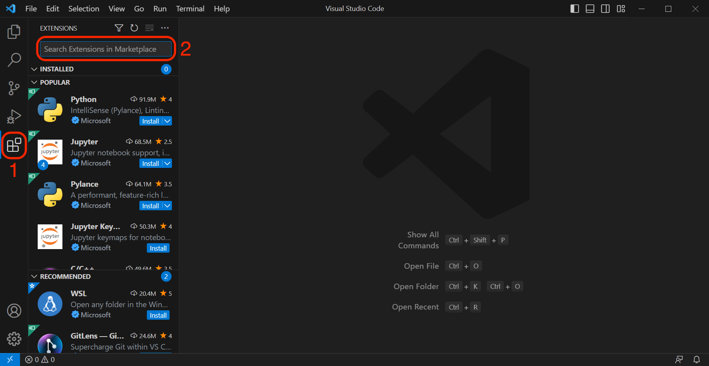
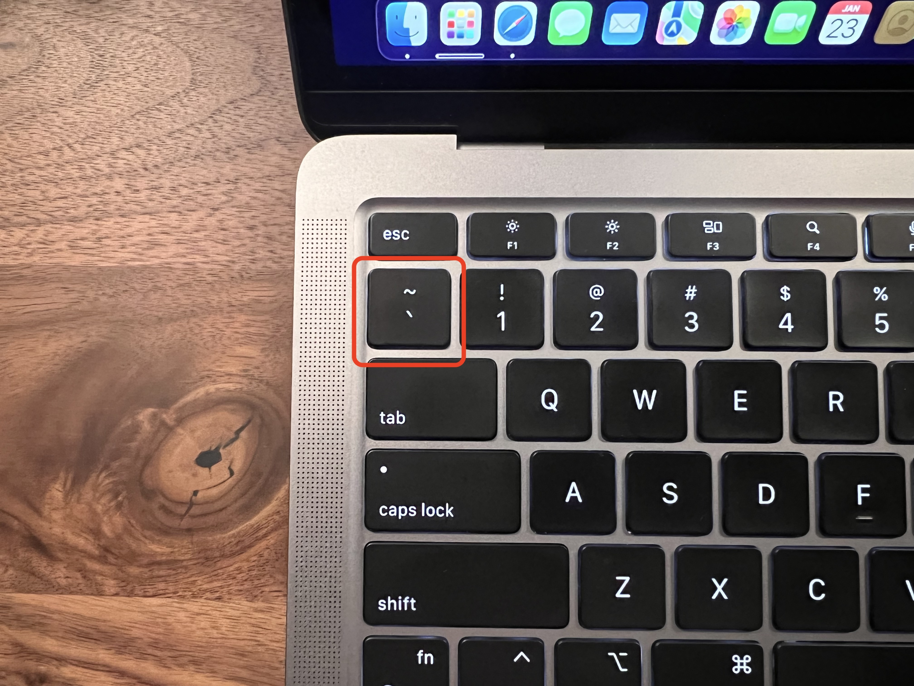

# Installfest - VS Code

If you’ve arrived here, you’ve likely just completed your installfest and need to set up VS Code. Congrats! But what is VS Code? Glad you asked!

## What is VS Code?

VS Code is a popular open-source text editor (you can find the source code [**here**](https://github.com/microsoft/vscode)) maintained by Microsoft. It's very customizable and capable. VS Code's functionality can be extended using extensions; however, most of its valuable features are built-in. We’ll be using VS Code the entire course, and you’ll be very familiar with it in no time.

You can open VS Code by launching your terminal and using the `code` command. This will be our preferred method for launching the VS Code application. If your `code` command isn't working, reach out to your installfest point of contact.

## Extensions

One of the most powerful features of VS Code is extensions. Many allow us to add features to VS Code that will increase our productivity. We've provided a selection of common ones below, but your instructor may add or remove from this list as they see necessary.

You may notice that additional extensions are installed when you install certain ones of these; this is expected and perfectly fine!

- **[Better Comments](https://marketplace.visualstudio.com/items?itemName=aaron-bond.better-comments)** - helps you create more human-friendly comments in your code.
- **[Color Info](https://marketplace.visualstudio.com/items?itemName=bierner.color-info)** - provides quick information about CSS colors.
- **[EJS Language Support](https://marketplace.visualstudio.com/items?itemName=DigitalBrainstem.javascript-ejs-support)** - Syntax highlighting for EJS, JavaScript, and HTML tags. Includes JavaScript autocompletion.
- **[ES7+ React/Redux/React-Native snippets](https://marketplace.visualstudio.com/items?itemName=dsznajder.es7-react-js-snippets)** - We’ll use this in React to quickly insert React boilerplate code.
- **[ESLint](https://marketplace.visualstudio.com/items?itemName=dbaeumer.vscode-eslint)** - Integrates ESLint JavaScript into VS Code. See the documentation for more.
- **[Live Server](https://marketplace.visualstudio.com/items?itemName=ritwickdey.LiveServer)** - Launch a local development server with a live reload feature for static & dynamic pages.
- **[Peacock](https://marketplace.visualstudio.com/items?itemName=johnpapa.vscode-peacock)** - For contextually changing the color of your VS Code workspace (We’ll use this when you’re working with decoupled front and back ends)
- **[Python](https://marketplace.visualstudio.com/items?itemName=ms-python.python)** - Linting, Debugging (multi-threaded, remote), Intellisense, Jupyter Notebooks, code formatting, refactoring, unit tests, snippets, and more.
- **[vscode-icons](https://marketplace.visualstudio.com/items?itemName=vscode-icons-team.vscode-icons)** - A file and folder icon library that supports thousands of different file and folder types.

### Windows extensions

If you’re running Windows, you should already have the **[WSL Extension](https://marketplace.visualstudio.com/items?itemName=ms-vscode-remote.remote-wsl)** installed!

## Optional Themes

Developers love making their workspace their own - one way to do this is through VS Code themes. Here are a few from the extension marketplace that come highly recommended:

- **[One Dark Pro](https://marketplace.visualstudio.com/items?itemName=zhuangtongfa.Material-theme)**
- **[One Monokai](https://marketplace.visualstudio.com/items?itemName=azemoh.one-monokai)**
- **[Dracula](https://marketplace.visualstudio.com/items?itemName=dracula-theme.theme-dracula)**
- **[Material Theme](https://marketplace.visualstudio.com/items?itemName=Equinusocio.vsc-material-theme)**
- **[SynthWave '84](https://marketplace.visualstudio.com/items?itemName=RobbOwen.synthwave-vscode)**

You can change your theme by pressing **`Command ⌘ + Shift + P`** on macOS or **`Ctrl + Shift + P`** on Linux and Windows to open the command palette. With the control palette open, type `theme` and select the **Preferences: Color Theme** option. From here, choose the theme you want to apply. Many themes come with VS Code by default, one of the best of which is the **High Contrast Theme**.

## Installing more extensions

You can install extensions you find useful as well. Make sure they don’t conflict with any extensions or tools we’re using in the course though - feel free to run whatever you’re interested in by an instructor first!

With VS Code open, select the extensions icon on the sidebar (#1 in the picture below), then search for the extension you want below in the Search Extensions box (#2).

## Accessing the Command Line Interface in VS Code

One last tidbit before we wrap up - we can start a terminal session from within VS Code! This is incredibly useful because it means we can stay in one application and do all our work instead of switching back and forth between VS Code and the Terminal applications.

To do this, use **`` Ctrl + ` ``** (that is a backtick - this key is above your **`tab`** key and to the left of the **`1`** key shown below). You don’t need to do anything with this now - just know that it’s possible and that it’s an action that we’re going to do *a lot* in the course!

The backtick key is outlined in red in the image above.