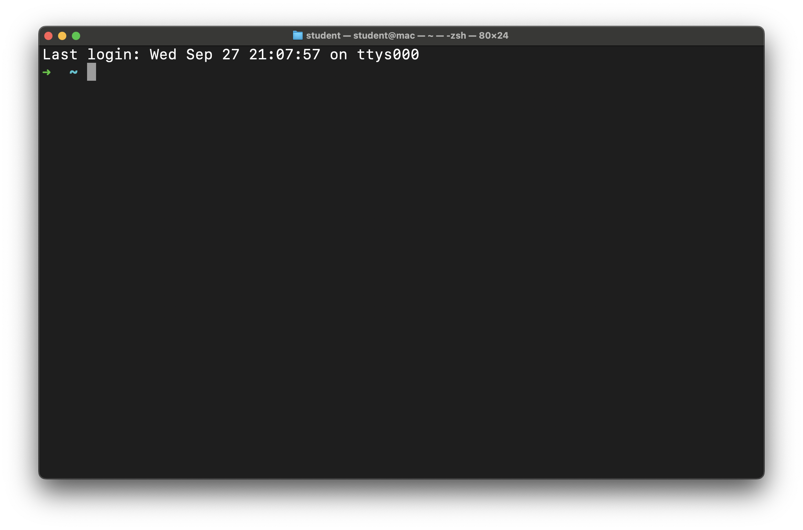
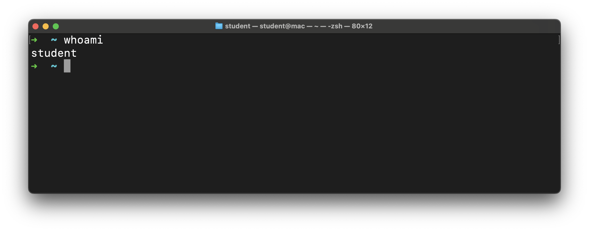
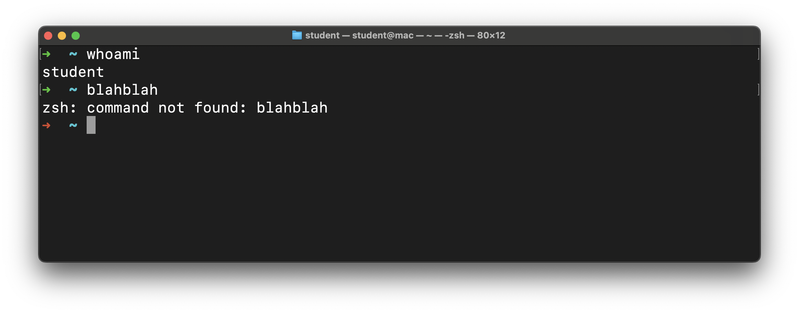

# Intro to CLI - Fundamentals 

**Learning objective:** By the end of this lesson, students will be able to open their OS's terminal application and run basic commands.

## Open the terminal application

How you open your terminal application will depend upon your OS.

### macOS

In macOS, use Spotlight to search for and open Terminal. Press `⌘ Command` + `Space` to open Spotlight and search for `Terminal`. Press `Enter` to open it.

### Windows

If you have not completed Installfest, you won't have your Terminal configured yet. Sit back and take everything in!

If you have completed Installfest, use your system search to launch the Windows Terminal application in Windows 10 or the Terminal application in Windows 11. Despite the difference in names, a search for `Terminal` should work on either OS.

### Ubuntu

Ubuntu is cool and has a built-in keyboard shortcut to launch the Terminal application: `Ctrl` + `Alt` + `T`.

You can search for `Terminal` on your system and launch the Terminal app that way.

A quick note on the Ubuntu Terminal - copying and pasting uses a different keyboard combination in the terminal.

To copy from the Ubuntu terminal, use `Ctrl` + `Shift` + `C`. To paste text in the Ubuntu terminal, use `Ctrl` + `Shift` + `V`.

## The terminal interface

Regardless of your operating system, when your terminal application launches, you should see a window similar to the following:



Note that this terminal is running Oh My Zsh. If you have not installed Oh My Zsh, it will look different. The concepts and commands discussed in this lecture will be identical, even if you have not installed Oh My Zsh.

Here, you'll see the *prompt*. Let's dissect it:


1. The arrow `➜` indicates that the computer is ready to receive input. We can type commands on this line, and they can be executed.
2. The tilde `~` indicates our current location in the file system. We'll cover this more soon.
3. The cursor `█`. When you start typing, this is where the text will appear and is how we write commands to be executed.

> 📚 The *prompt* is a sequence of characters used in a command-line interface to indicate readiness to accept commands.

## Your first command

Since the computer is ready to receive input, let's type in a command:

```bash
whoami
```

Notice that we have control over when this command is executed. If you make a typo, there's still time to go back and fix it. Use your keyboard's arrow keys for this though; clicking with the mouse doesn't work here!

No typos? All ready to run this? Hit `Enter`!



This command has a simple job - print the username of the user that runs this command. In the screenshot above, the username is `student`. Yours will likely be different!

After that command finished executing, we were greeted by the prompt once again, and we're free to type more commands!

Let's try an invalid command, just to see what happens:

```bash
blahblah
```

Again, after you've typed this in, hit `Enter` to execute it.



Our first error! And it's pretty self-explanatory - `zsh: command not found: blahblah`.

We purposefully ran a command we knew was invalid, so it makes sense that it wasn't found. When you see this error, you're trying to run an invalid command!

> 🧠 Notice that the arrow `➜` at the start of the line after we received our error is red. All that this means is that the last command we ran failed in some way; we can still write and execute commands on this line.