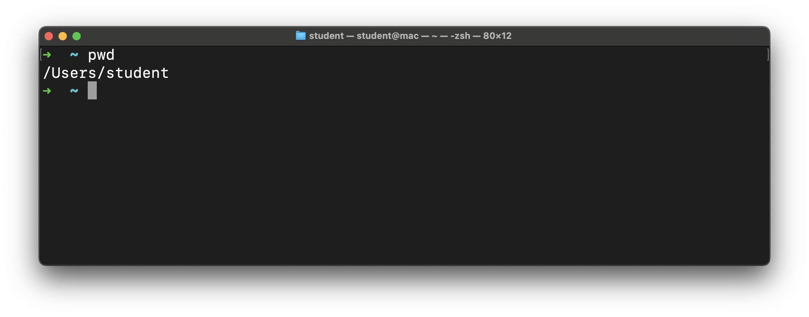
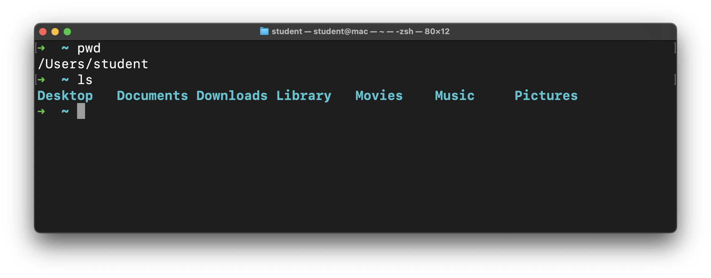
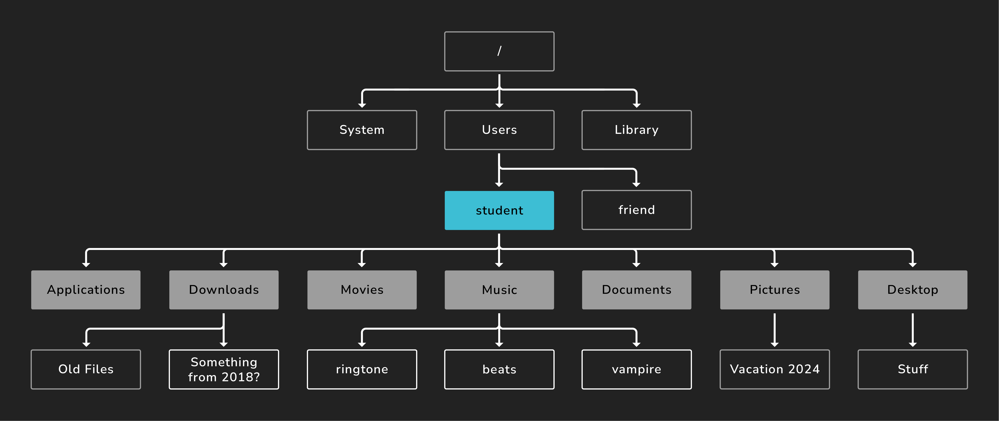
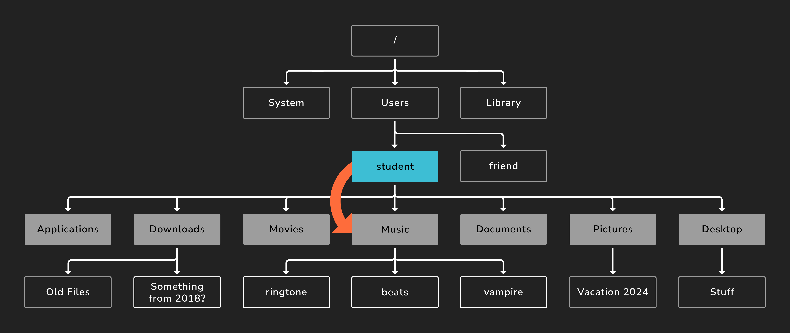
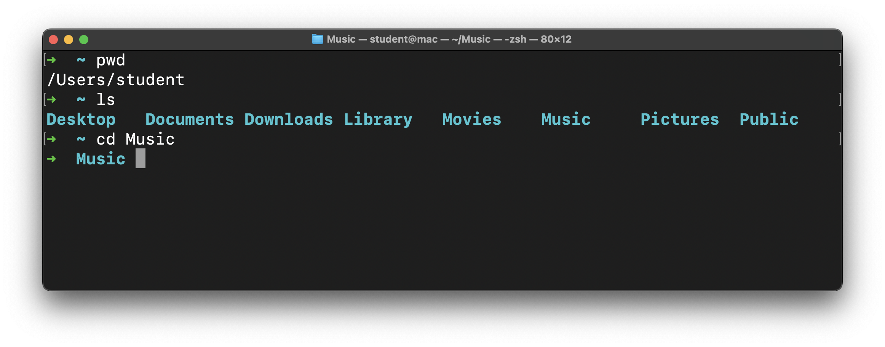

# Intro to CLI - Navigating the File System

**Learning objective:** By the end of this lesson, students will be able to apply CLI commands like `pwd`, `ls`, and `cd` to efficiently navigate and interpret a computer's file system.

## `pwd`

The `pwd` command prints the current (working) directory's path.

You'll recall from earlier that the `~` we see in the prompt on the command line is shorthand for the current user's home directory. This command will confirm that. Write and execute this command now:

```bash
pwd
```



The screenshot above shows the path to the directory we're in right now (`/Users/student`). Your device likely shows something different, and that's expected. The home directory is where we start when we launch the terminal app.

This is important. Just like when you have a location in a store while walking around it, we have a location in the file system when navigating it. If in the process of moving the file system in the CLI, you're not sure where you are, run this command to see the path to your current location.

## `ls`

Let's take a look around with the `ls` command. This command lists the contents of the directory we are in. In other words:

- The directories inside this directory
- The files inside this directory

```bash
ls
```



The output of this command may be different for you, but that's okay! If you're on Windows and just installed WSL, you may not see anything here; that's also okay and expected!

 The visual below might help demonstrate what's happening here. The `student` directory (the current working directory) has been highlighted in blue. From this directory, the `ls` command will display its direct children, shown in dark gray. The other files and directories still exist. They aren't shown by this command though.



## `cd`

We can change the current directory with the `cd` command. This command works slightly differently than the other ones we've covered so far because we need to supply the command with a *command argument*. This is additional information we provide to the command to help it do its job. In this case, the *command argument* tells the `cd` command where we'd like to go - a path to a directory.

We just ran the `ls` command that gave us a list of valid destinations, including the `Music` directory. You might not have this directory. If not, pick another one.

Let's write and execute a command to change to that directory.

```bash
cd Music
```

In this line, `cd` is the command, and `Music` is the *command argument*. Notice the space between them.

`Music` is also a *relative path*. A *relative path* is the path from the perspective of the current directory. We'll use relative paths more often than absolute paths. Think back to the store example - if you wanted to go from the canned goods aisle to the bread aisle, you wouldn't leave the store and come back in. You'd just navigate from the canned goods aisle to the bread aisle.



You could supply an absolute path as the argument if you wanted.

> 📚 A *command argument* is an additional input provided to a command that gives it the necessary data to accomplish a task.
>
> A *relative path* is the path to a directory or file from the perspective of the current working directory. This contrasts from an *absolute path* which is written from the perspective of the *root* or `/` directory.

Here's what happens when we run that command:



The prompt has changed! The `~` has been replaced with `Music` because we're now in the `Music` directory. This confirms our command worked!

If we rerun `pwd`, we'll see that we're now in `/Users/student/Music` (or something similar).

> 🧠 Instead of typing `pwd` in the command line, you can find it from the previous commands you have run by hitting the up arrow on your keyboard. This cycles through all the previous commands you have executed.

Let's go back to the user home directory. We have a couple of options available to do this. Choose only one to write and execute.

- We could return directly to the user home using the `~` shortcut. Here's that command:

  ```bash
  cd ~
  ```

- We can also use `..`, which represents the parent directory of the current directory. This method works because the `Music` directory is the child of the user home directory. Here's the command to do this:

  ```bash
  cd ..
  ```

In this situation, these commands have the same result - changing the current working directory to the user home directory.