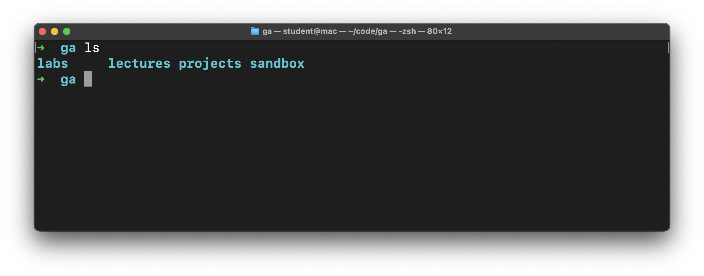

# Intro to CLI - Manipulating the File System

**Learning objective:** By the end of this lesson, students will be able to execute CLI commands such as `mkdir`, `touch`, `rm`, and `rmdir` to create, modify, and delete files and directories.

## Creating

Let's create directories and files! We'll get some additional practice navigating the file system too.

### `mkdir`

The `mkdir` command is used to create directories. The `mkdir` command takes a command argument like the `cd` command did. The meaning of that argument is different in this case though. Here, we will specify the path to the directory we want to create. We'll use a relative path again.

Ensure your prompt indicates that you're in the `~` directory. If you're not, run:

```bash
cd ~
```

Once you're there, let's try out the `mkdir` command:

```bash
mkdir code
```

Running this command will create a `code` directory! Let's move into that directory with the `cd` command.

This time, only type `cd co` into the command line, then hit the `Tab` key. This should autocomplete the rest of the line, and it should now say `cd code`. Execute that command!

This is called tab completion, and it is the best.

> ♻ **Repeatable pattern:** Tab completion will let you do less typing and save time. It's also more precise than manually typing paths out because it will only complete valid commands and paths. It's also a great tool in VS Code when we start using it.

### 🎓 You Do

Create another directory of your choice and move into it.

### `touch`

You should be in the directory that you just created.

The `touch` command works very similarly to the `mkdir` command, except instead of creating an empty directory, it creates an empty file. Files typically have a file extension like `.html` for HTML files or `.png` for PNG image files.

```bash
touch file.txt
```

The command creates a file with the `.txt` extension, representing a text file.

## Deleting

We may have created more than we need; let's clean up some.

### 🎓 You Do

Delete the file and the directory that you just created.

- Use the `rm` command to delete the `file.txt` file. The syntax for the `rm` command is similar to the `touch` command, but it destroys instead of creates. There is no trash to recover files from after they are deleted with this command, so use it carefully.
- Navigate out of the current directory so you can delete it. Maybe return to the parent directory like we did earlier?
- Use the `rmdir` command to delete the directory you created in the **You Do** section earlier. This command works similarly to the `mkdir` command but will destroy instead of create like the `rm` command. This command will only delete empty directories.

After you've accomplished those tasks, create the directory structure we'll use for the rest of the course.

In your `code` directory, create a `ga` directory to hold everything you do at General Assembly. Inside of this `ga` directory, make four more directories:

- `labs` - For all lab assignments.
- `lectures` - For all class lectures.
- `projects` - For any large projects done in a course.
- `sandbox` - For quick experimentation.

All lecture material will assume you have this base directory structure, but if you'd like, you may further divide these directories based on topic, week, or any other method you choose.

When you're done, you should be able to run the `ls` command in the `ga` directory and see the following:

