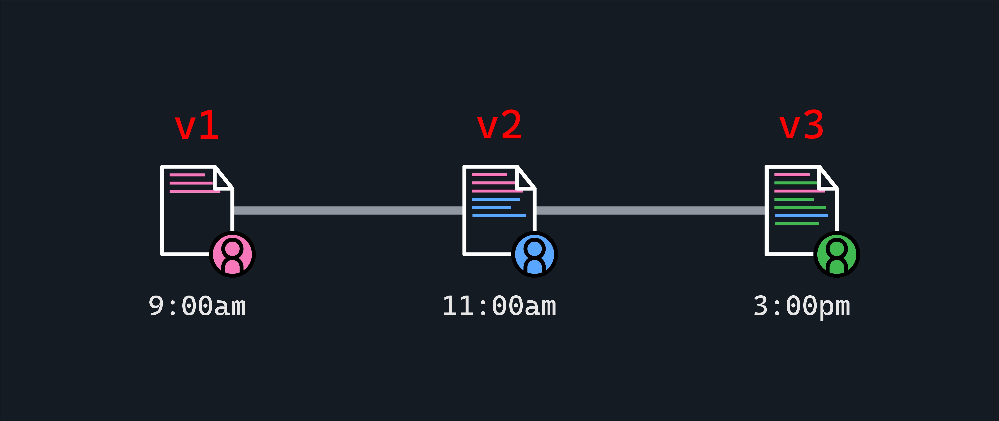

# Intro to Git and Github - Git Concepts

**Learning objective:** By the end of this lesson, students will be able to describe the purpose of version control and identify fundamental components of Git-based version control.

## What is version control?

Broadly, version control systems keep track of changes made to files over time, recording these details:

- What was changed
- Who made the changes
- When the changes were made

Version control allows us to view old versions of files, and even enables us to revert to an old version if necessary.

It also makes working in teams easier because it enables people to work on the same project without accidentally overriding each other's changes.

## Why use version control?

As engineers, version control lets us:

- Review changes made over time and see who did what.
- Work with others.
- Experiment without impacting the main codebase. If the new idea works, it can be added to the main project; if not, it can be discarded easily.
- Return to an older version, which is particularly useful if a bug has been introduced into the code.
- Work offline, then sync later when reconnected.

## Git-flavored version control

We'll use [Git](https://git-scm.com/) - the world's most popular version control system in this course. [Linus Torvalds](https://en.wikipedia.org/wiki/Linus_Torvalds) created Git in 2005 to help develop his main project at the time - Linux.

Git is designed to track code changes. Using Git enables developers to collaborate, manage code history, test ideas, and more. Git can work alone or with social platforms that layer in additional features. Git has a few core concepts, which follow:

### Git repository

A Git repository (aka Git repo, or just repo) is essentially a copy of a project. What makes the repo special is that it holds key details for every line of code in a project regarding:

- Who touched which part of the code.
- What they changed.
- When it happened.
- Documented information about the change.

This information helps developers use Git to collaborate, track changes through time, or even revert to previous versions when necessary.

Git repositories can be stored locally on a developer's machine or hosted on remote servers like GitHub.

### Git branch

Branches are used to test new ideas or build new features, and they help developers working on the same project avoid accidentally messing up each other's code.

In this course, we will use the `main` branch as our central source of truth and the default branch name. This is also the default branch name on GitHub.

### Remotes

A remote is a reference to a repository hosted on an external server, allowing synchronization and collaboration between a local Git repository and its counterpart located elsewhere.

In this course, remotes typically take the form of a URL pointing to a repository on GitHub, but other code-sharing platforms like GitLab and BitBucket exist. When collaborating, these external repositories provide a centralized location for sharing, updating, and accessing a codebase among multiple team members. We'll discuss remotes in more detail when we cover GitHub itself.