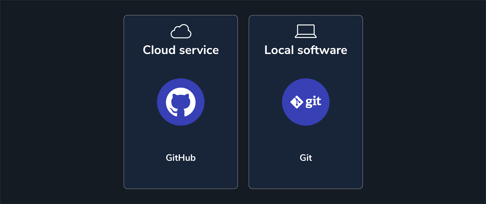

# Intro to Git and Github - Github Concepts

**Learning objective:** By the end of this lesson, students will be able to compare the functions of Git and GitHub, and describe key GitHub features that facilitate collaborative coding.

## What is GitHub?

[GitHub](https://github.com) is a web-based platform primarily used for version control and collaborative software development. Using it, we can back up and share our local Git repositories with the world. It is the most prominent online storage space for collaborative work.

GitHub fosters community collaboration through features such as [issues](https://docs.github.com/en/issues/tracking-your-work-with-issues/about-issues) and [pull requests](https://docs.github.com/en/pull-requests/collaborating-with-pull-requests/proposing-changes-to-your-work-with-pull-requests/about-pull-requests), which help developers track bugs and review code before integrating changes. These features collectively ensure smooth teamwork and efficient project management among developers.

In short, it is a social network for developers like us!

## Why use GitHub?

GitHub serves as a vital cloud-based backup for your code. This safeguards against data loss due to hardware failures or other issues. Regularly pushing code to GitHub ensures that your valuable work is preserved and can be easily recovered.

GitHub is essential for collaboration, enabling developers worldwide to create remarkable projects by sharing their Git repositories. It's a tool you'll frequently use throughout your software engineering career, well beyond the duration of this course.

## How are Git and GitHub different?

Git is a CLI tool that provides us with local repositories for tracking changes to our code on our computers.

GitHub is an online web service that provides us with remote repositories stored in the cloud.  We can use it to back up and share the Git repositories on our own computers.

## GitHub flow

The remainder of this module introduces the mechanical process of GitHub flow, as detailed in [GitHub's documentation](https://docs.github.com/en/get-started/using-github/github-flow). GitHub describes GitHub flow as "a lightweight, branch-based workflow [...] useful for everyone, not just developers."

GitHub flow is just one of many different ways to work either alone or on a team using GitHub. It is widely used, powerful, and practical.