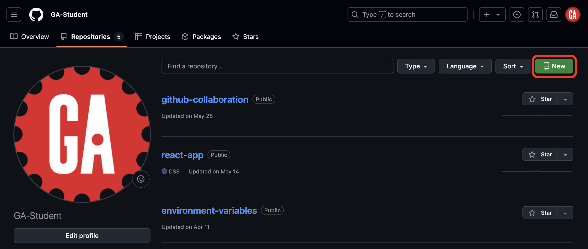

# Intro to Git and Github - Create and Clone a GitHub Repo


**Learning objective:** By the end of this lesson, students will be able to create and clone repositories on GitHub to set up collaborative projects.

## Creating a repository

We'll start by creating our repo on GitHub. Navigate to <https://github.com> now and ensure you're signed in.

There are two primary ways to get to the new repository page. You can use the dropdown menu from the main nav bar:


If you're on your GitHub profile page, you can alternatively click on the **Repositories** tab and select the **New** button:

> ⚠ If you have never made a repository, you will not have a repository tab yet!



You'll be taken to the **Create a new repository** page.

Follow the steps outlined below to create your repository:


1. Ensure you are the owner of the repository.
2. Be sure that you select an appropriate name for the repository. Many organizations use lower-kebab-case for their repo names, but there are no strict rules for repo names, except they must only contain [ASCII](https://en.wikipedia.org/wiki/ASCII) letters, digits, and the characters `.`, `-`, and `_`. In this activity, you should use the name `my-project`.
3. If you plan on sharing it with others (for example, if you're creating something you will eventually submit as a deliverable), be sure it is public.
4. Do not add a README file.
5. Do not add a <code class="filepath">.gitignore</code> template.
6. Do not choose a license.
7. After confirming the above details, select the **Create repository** button.

Congrats, you've created a repository on GitHub! This repository will act as our remote for this exercise.

## Cloning a repository


Cloning allows us to take the current version of a project from a remote repository on GitHub and copy it into a local repository on your computer.

You'll follow these steps any time you want to make a copy of a project that already exists on GitHub.

### Step 1

Navigate to the parent directory where you want the cloned directory to exist:

```bash
cd ~/code/ga/lectures
```

### Step 2

Use the `git clone` command to clone the repo from GitHub. It has this base signature:


1. The `git` command is necessary to carry out actions using Git on the command line.
2. The `clone` subcommand specifies we want to clone a repository.
3. The URL of the remote repository we want to clone.
4. When cloning a repo from GitHub, `github-user` will always be the username of the repository owner on GitHub. For example, the demo account in the screenshots has the username `GA-Student`.
5. When cloning a repo from GitHub, `repo-name` will always be the name of the repository you'd like to clone. For example, in this practice activity, the repo name is `my-project`.

Use the `git clone` command along with the URL of the GitHub repo you just made to clone the repository. It will look similar to the following:

```bash
git clone https://github.com/github-user/my-project
```

Do not copy the above command. It will not work. Your username will replace `github-user` in the URL above. Also, make sure `my-project` matches the name you gave the repo when you created it.

> 💡 When you clone a repository, a directory matching the repository's name on GitHub will be created automatically.
>
> For example, when we clone the `my-project` repo, all the files in that repo will be copied into a new `my-project` directory. Note that there are currently no files in this repository.

### Step 3

Navigate into the new directory and open it in VS Code:

```bash
cd my-project
code . 
```

> 🧠 When you clone a repository, an origin remote will automatically be set using the URL you used to clone it. You can confirm this with the `git remote -v` command. If you've cloned a repository that you don't own (or have write access to), you won't be able to send changes to that repo on GitHub!