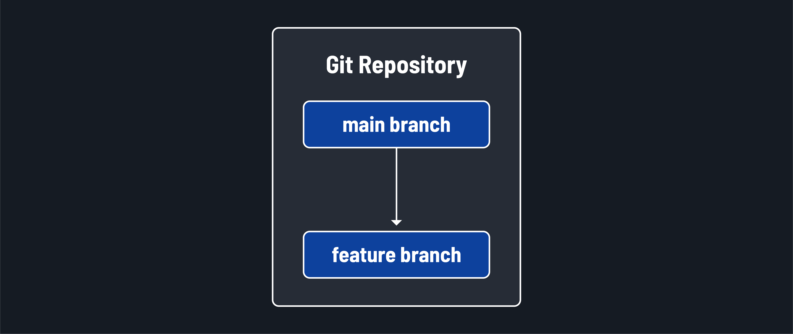
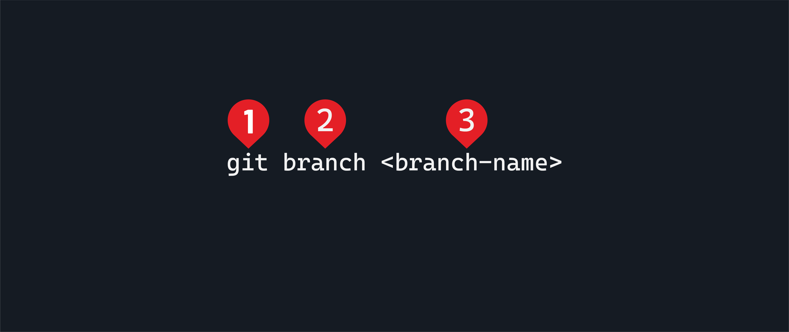
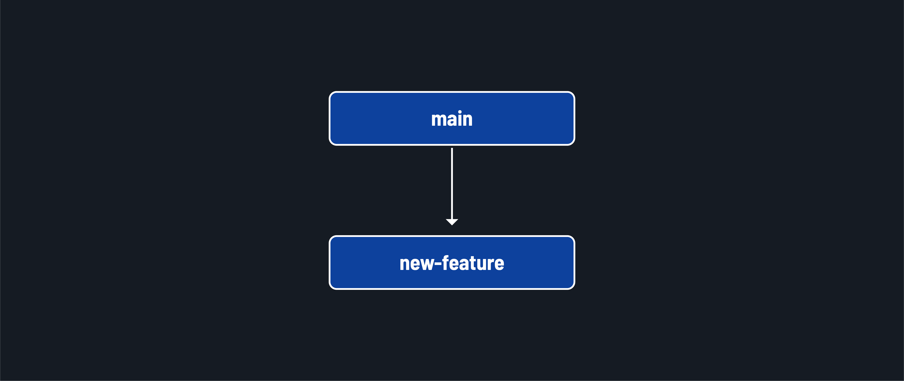
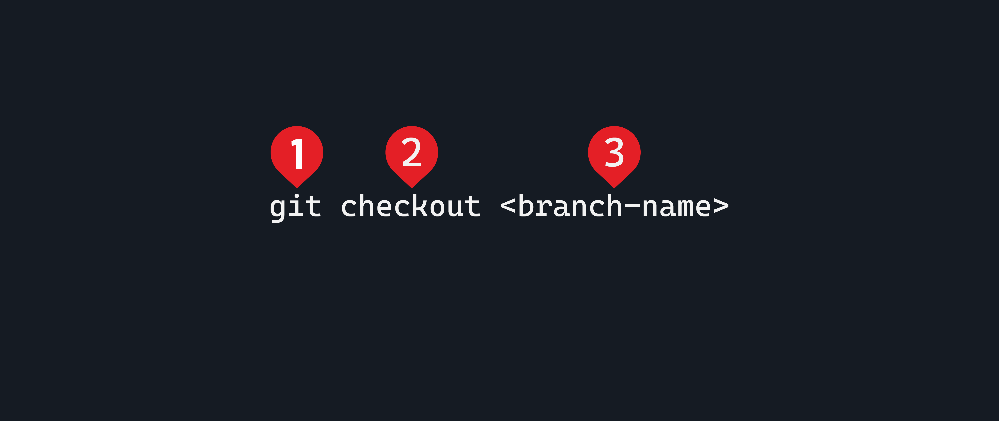
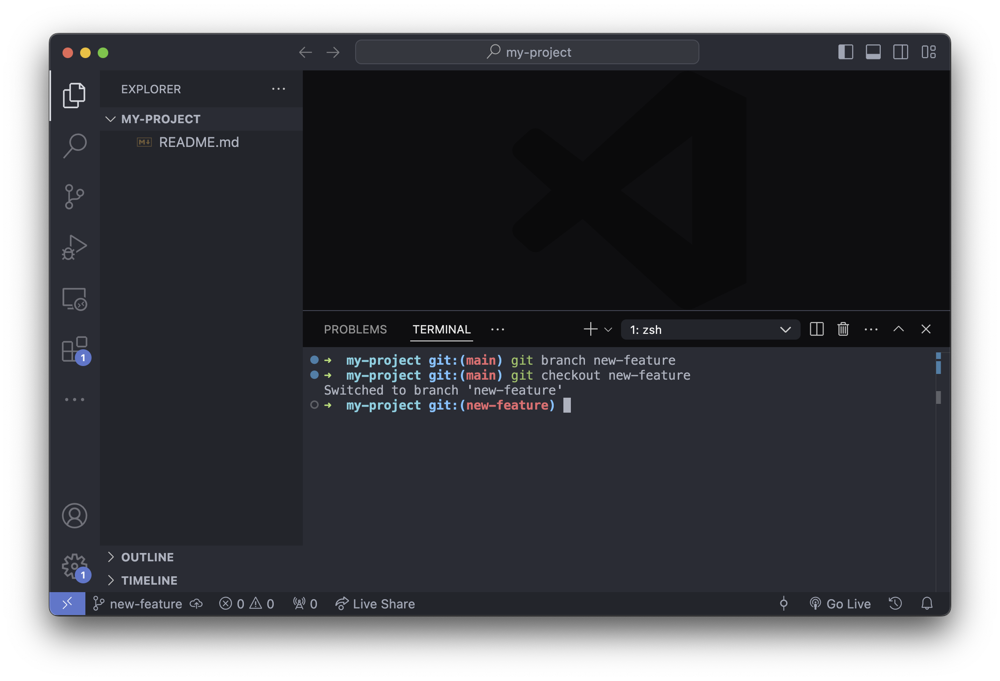

# Intro to Git and GitHub - Git Branching

**Learning objective:** By the end of this lesson, students will be able to manage branches in Git following GitHub flow, including creating branches and switching between them.

## Branching

We've cloned the repository and are ready to start working on it. But how do we manage our changes and collaborate with others? This is where branching and working with branches come in.

We've already touched on the `main` branch of a repository. This is the default branch for a repo created on GitHub. It represents the main line of development on an application and is typically considered the most up-to-date source of truth for code in a repository. It has its own history, allowing you to view how it has changed over time.

We never write code directly in the main branch when we use GitHub flow. Instead, we develop in feature branches.



Working in a branch allows you to create separate lines of development within a repository. This means you can work on different features, bug fixes, or experiments without affecting the code in the `main` branch. Each branch has its own history, allowing you to view how it has changed over time.

> 🧠 Branching is like creating a parallel universe where you can experiment with new features, fix bugs, or refactor code. Branches are even more beneficial when collaborating because they allow everyone working on the code to build without impacting others.

Whenever our work in the branch is complete, it can be merged into the main codebase through a pull request.

> 🧠 We will talk about merging and pull requests in later lessons.

## Create a branch

Open the terminal in VS Code.

Use the `git branch` command to do work on branches. It has this base signature:



1. The `git` command is necessary to carry out actions using Git on the command line.
2. The `branch` subcommand specifies that we want to do work on branches.
3. Optionally, you can provide a branch name in place of `<branch-name>`. When a branch name is provided, it will be created if it doesn't already exist. Branch names should be kebab case.

If we use the `git branch` command without providing a branch name, it will show us a list of the current branches. Try this now:

```bash
git branch
```

You should see a list of branches (the only branch currently is the `main` branch) with an asterisk (`*`) next to the branch you are currently on (`main`).

Hit the <kbd>Q</kbd> key to exit this view.

Let's create a new branch on the repository we cloned in the previous lesson. Run the below command in your terminal:

```bash
git branch new-feature
```

This command creates a new `new-feature` branch. The branch we were in when we ran the command (in this case, the `main` branch) is used as the starting point for the new branch.



> 🚨 When using GitHub flow, you will ***never*** write code in the `main` branch of a repository. You will still interact with the `main` branch, but you will not write code there.

Let's view the list of branches to confirm that the new branch was created:

```bash
git branch
```

You should see a list of branches with an asterisk (`*`) next to the branch you are currently on (`main`).

Hit the <kbd>Q</kbd> key to exit this view.

## Switch to a branch

Use the `git checkout` command to switch to the new branch. It has this base signature:



1. The `git` command is necessary to carry out actions using Git on the command line.
2. The `checkout` subcommand can be powerful and complex, but we'll only use it to switch to a different branch in this course.
3. The branch we want to checkout in place of `<branch-name>`.

To switch to the new branch, use the below command:

```bash
git checkout new-feature
```

If you use the `git branch` command again, you should see the asterisk next to the new branch, indicating that you are now on the new `new-feature` branch.

Hit the <kbd>Q</kbd> key to exit this view.

The prompt on your terminal should change as well. The screenshot below shows this flow.



You've created a new branch and moved into it! 🎉