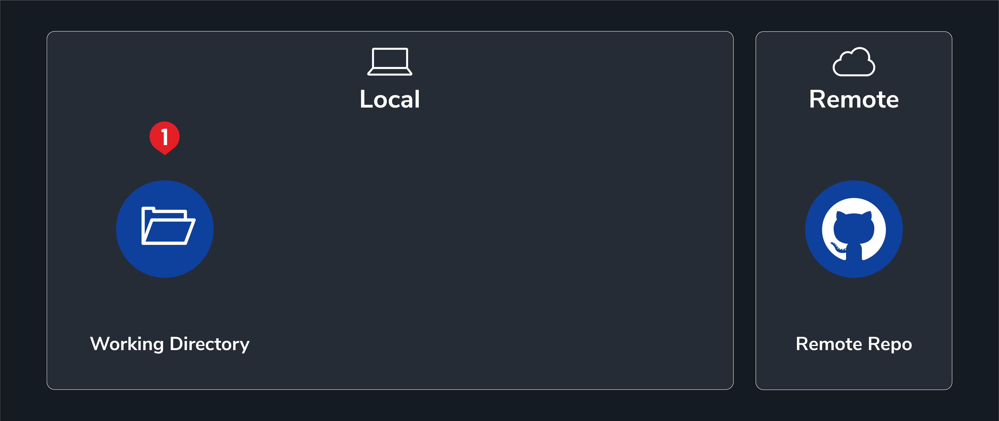
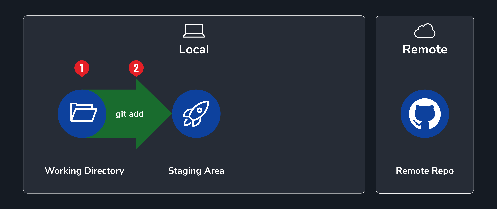
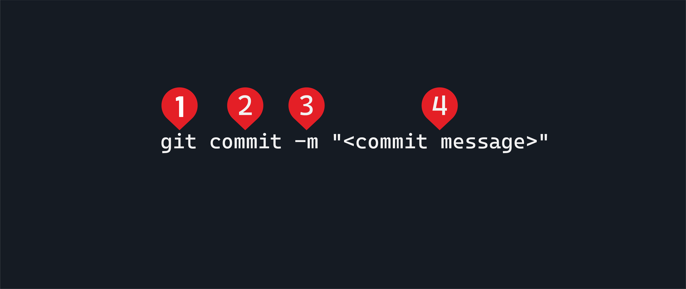
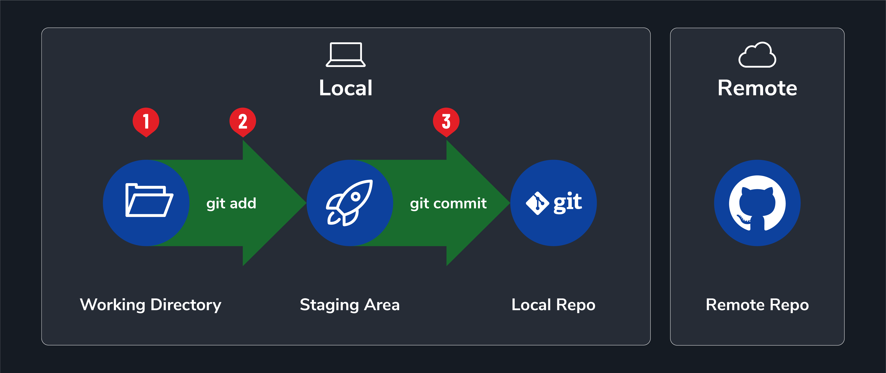
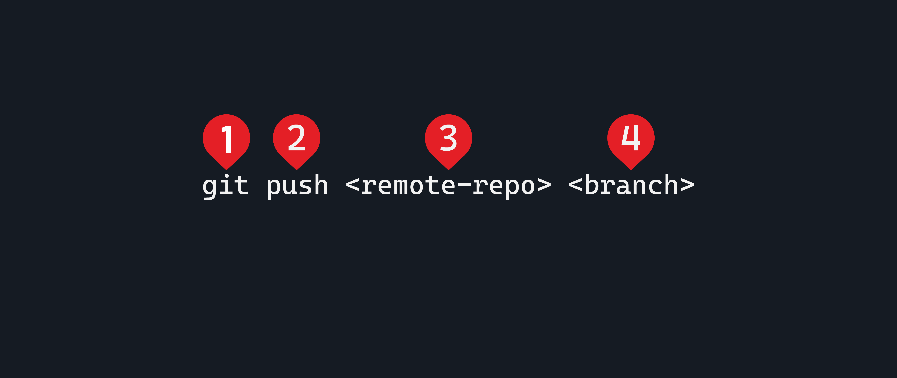
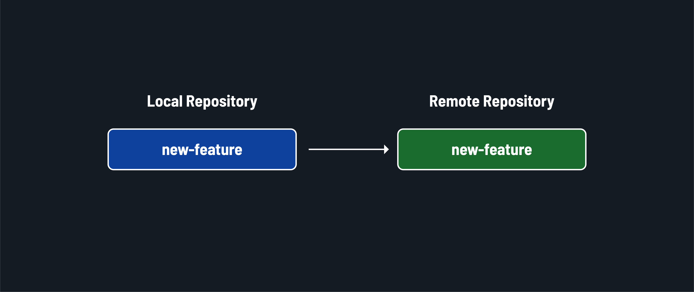
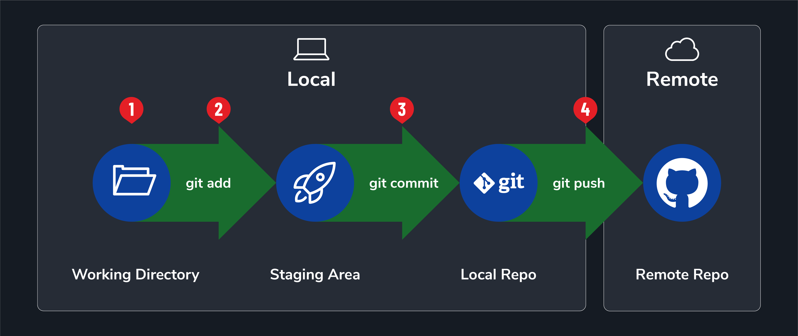
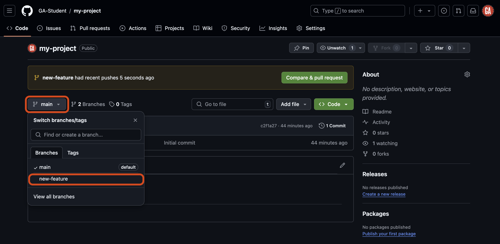

# Intro to Git and GitHub - Contributing Code

**Learning objective:** By the end of this lesson, students will be able to contribute code to a GitHub repo by writing, staging, committing, and pushing code.

## Branches are parallel universes

Let's see what it will look like as you contribute code to a project.

When we used the `git branch new-feature` command, we created a new branch using the `main` branch as a starting point.

This means all the files and code in the `main` branch were duplicated into the `new-feature` branch. From now on, any code we write will ***only exist in this feature branch***. Let's explore the four-step workflow to add code to a project locally and contribute that code back to a remote repository.

1. Write code
2. Stage (add) work
3. Commit staged work
4. Push committed work

## 1. Write code



Write code just as you always would! Nothing about this step changes when adding Git to your workflow.

Just like the payload on a rocket needs to be thought out and built before it can be added to its payload, you'll do the same with your code!

Create a new markdown file with this command:

```bash
touch my-new-feature.md
```

Open the file and add a line of content to it.

## 2. Stage (add) work

After making changes to your code, you will use the `git add` command to stage those changes. It has this base signature:


1. The `git` command is necessary to carry out actions using Git on the command line.
2. The `add` subcommand is used to add files.
3. The `-A` flag indicates that all of the possible files in the current Git repo should be added.

Use this command to add all the files now:

```bash
git add -A
```

### What it does

This command adds everything in the current directory to a staging area, where they will be included in the next commit.

The staging area is an intermediate space where changes to files are stored before being saved (aka committed) to the repository.

### When and why we use it

Use this command after changing files you want to potentially commit to the local repository. To track file changes, you must add them to the staging area.



We are also able to add one file at a time, or multiple, by providing one or more filepaths to the `git add` command, for example:

```bash
git add index.html
```

When doing collaborative coding, it will become clearer why not adding every single file at once can be beneficial. For now, `git add -A` will work great!

Continuing the rocket analogy, running the `git add` command puts the payload next to the rocket to be loaded. Nothing is finalized yet; changes could still be made, but preparations are happening.

## 3. Commit staged work

After adding files to the staging area, you will use the `git commit` command to save the changes in those files to the git repo. It has this base signature:



1. The `git` command is necessary to carry out actions using Git on the command line.
2. The `commit` subcommand is used to save changes to the repository.
3. The `-m` flag specifies we'll provide a commit message on the command line.
4. The actual commit message in place of `<commit message>`. This message should succinctly describe the change that the commit will make to the repository. This commit message should be surrounded by quotes.

Use this command to commit the changes in the staging area now:

```bash
git commit -m "add my new feature"
```

### What it does

This command allows you to provide a checkpoint where you can save the recent changes you've made to your code. It also allows you to enter a message describing the changes made to your code for future reference.

Commit messages should describe the changes that the code is making. For example, if a commit fixes a typo in your code, the commit message should be `"fix typo"`. Stay away from messages like "stuff" or "fix".

Different organizations have varying commit message standards that you will need to conform to when you contribute to their code bases.

### When and why we use it

Use this command after adding changes to the staging area to commit those changes. Commits provide a list detailing changes that have been made to your code. This allows you (or anyone viewing your repository) to see the changes to code made over time. It also allows you to revert to previous versions of your code if you break something and can't figure out how to fix it.



Committing your code is putting the payload onto the rocket to be launched. Whenever the rocket takes off, it will carry the committed code.

## 4. Push committed work

Everything you have done here is local to your machine. When you created the `new-feature` branch, it was only made locally. This means that the branch and the changes it holds only exist on your machine.

You must send the branch that currently only exists locally to the remote repository so that it is available on GitHub. Let's do that now with the `git push` command. It has this base signature:



1. The `git` command is necessary to carry out actions using Git on the command line.
2. The `push` subcommand updates a remote repository.
3. The URL of the remote repository, or more commonly, the friendly name of the remote repository in place of `<remote-repo>`. When a repository is cloned, the URL used to retrieve it is automatically added as a known remote repo and given the friendly name `origin`.
4. The branch that should be pushed to the remote repository in place of `<branch>`. If it doesn't exist, a branch with the same name will be created in the remote repository. If it does exist, the remote branch must not contain any work that does not exist in the local branch, or the push will fail.

In your terminal, run the following command now to push the `new-feature` branch to the `my-project` repo on GitHub:

```bash
git push origin new-feature
```

### What it does

This command sends all the committed changes to a remote repository.



### When and why we use it

Do this after you `git add -A` and `git commit -m "Your commit message"`. This will get your code up to GitHub from your computer. You push it from a local repository up to a repository hosted by GitHub.



Finalizing the rocket analogy 🚀 - pushing your code is like launching the rocket and sending its payload to planet GitHub for all to see!

If you go to the repository on GitHub, you will see that there is now a `new-feature` branch.

