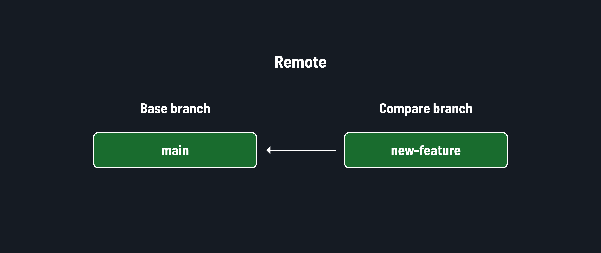
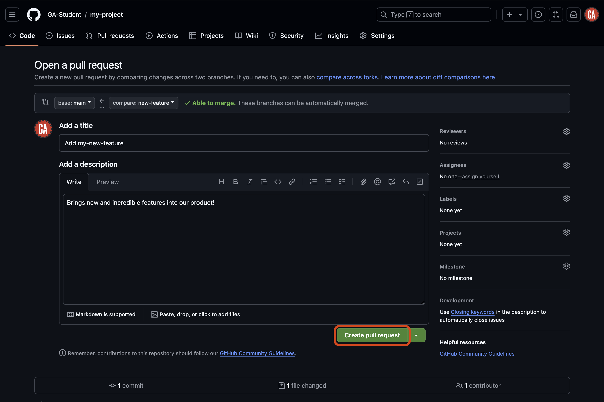
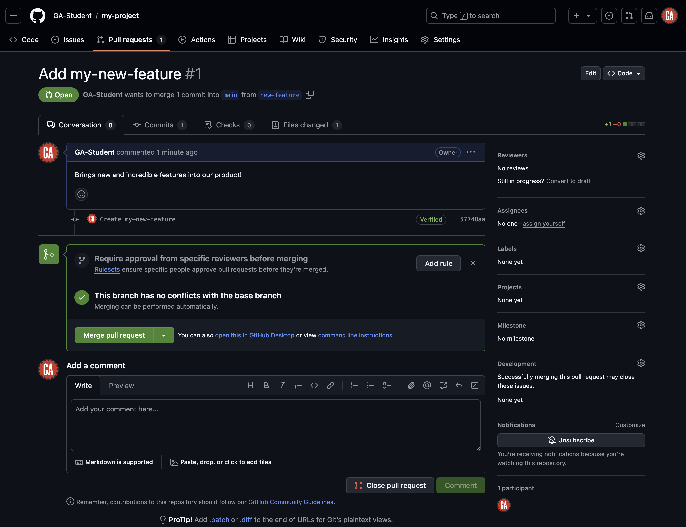
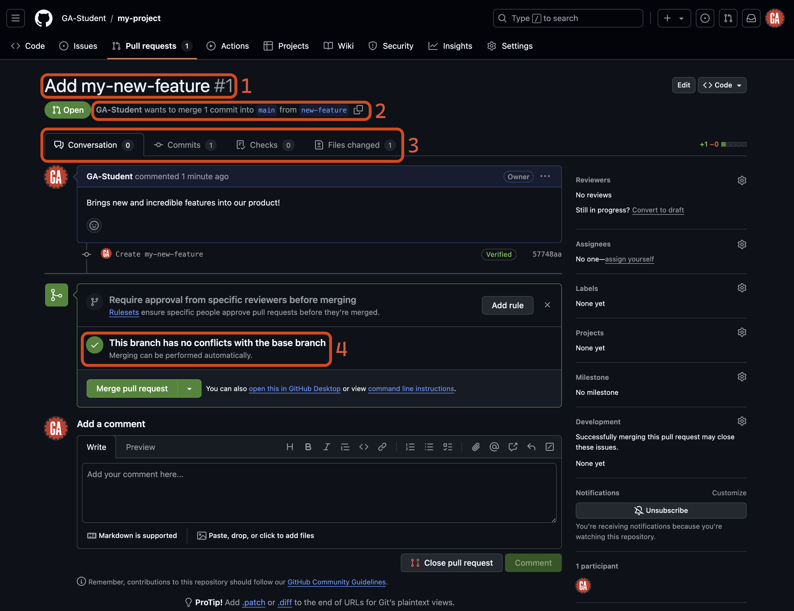
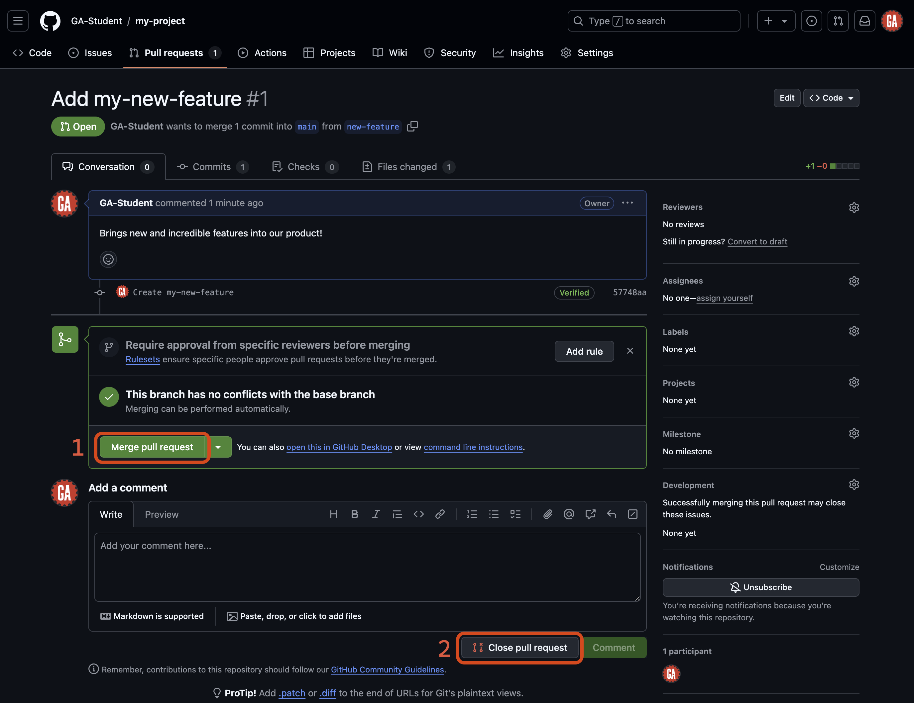

# Intro to Git and GitHub - Create and Merge Pull Requests

**Learning objective:** By the end of this lesson, students will be able to create and manage pull requests on GitHub, using them to review and merge changes collaboratively.

## What's a pull request?

Pull requests (often abbreviated as PRs) allow developers to propose changes to a branch in a repository on GitHub. They are a way to review code and discuss changes before merging them into the main codebase. Pull requests are central to collaboration and allow developers to contribute their code to a larger project.

After pushing your code to a branch on GitHub (as we've already done), the next step is to integrate it into the `main` branch by creating a pull request.

## Creating a pull request

There are many different methods to create a pull request on GitHub. The steps outlined below will ensure a repeatable and consistent experience in as few steps as possible.

You will need:

- Your GitHub username.
- The name of the repository you're working in (`my-project` for this activity).

Navigate to this URL after making the necessary changes to it:

```plaintext
https://github.com/<github-username>/my-project/compare
```

Replacing `<github-username>` with your GitHub username.

> 💡 When working on a project for a prolonged period, it is wise to bookmark this page for easy access!

You should arrive at a page similar to the one shown below.


### Comparing changes

When you navigate to the pull request page, you will see the `Comparing changes` section. This section is where you will select the branches you want to compare. Two dropdowns in this section allow you to choose the base branch and the compare branch.



- **Base branch** - This is the branch you want to merge your changes into. This is typically the `main` branch.
- **Compare branch** - This is the branch you want to merge into the base branch. This is typically the feature branch you have been working on. In our case, it is `new-feature`. Note the arrow going from the ***compare branch*** to the ***base branch*** - this indicates the flow of your code.

You can see these dropdowns outlined in red in the screenshot below.


Select the **compare** dropdown, and select the branch you want to compare to the `main` branch. This is outlined in red in the screenshot below (although the branch name you want to compare to the `main` branch will be different). Note the search feature here - it may be necessary to use this when more branches are made in a repo.


After selecting a branch, you'll see the changes made if the pull request is merged. The screenshot below shows that there will be one changed file. One line of code will be added, and no lines will be deleted. After you review the changes, select the **Create pull request** button outlined in red below.


## Open a pull request

You'll be taken to a new page where you can open your pull request. Here, you will give your pull request a title and summary.

1. **Title**: The title should concisely describe the change the pull request will make to the main branch, similar to a commit message. Keep it short but descriptive.

2. **Description**: Detail the changes your code will make here. This will help a reviewer understand what changes you made and why. When working alone, you'll review your own pull requests, but developing these documentation habits can be useful.

After setting up the title and description, select the **Create pull request** button as outlined in red below. This will create the pull request and take you to the pull request page.



> 🧠 You can still create a pull request even if you cannot automatically merge your changes.

Congrats! You have created a pull request! 🎉

## Merging a pull request

Merging is the process of incorporating changes from one branch into another. When you merge branches, Git will automatically determine the best way to combine the changes. However, sometimes, Git cannot automatically merge the changes, resulting in a merge conflict. In this section, we'll focus on merging pull requests on GitHub.

Merging branches remotely is done through a pull request, which is advantageous because we have a pull request waiting for us! When merging remotely, you'll do your work on GitHub's website.

> 💡 You can view all the open pull requests for a repo at this address (after modifying it):
>
> ```plaintext
> https://github.com/<github-username>/<repo-name>/pulls
> ```
>
> Replace `<github-username>` (including the `<` and `>`) with the GitHub username of the repo owner. Also, replace `<repo-name>` (including the `<` and `>`) with the repo name.

Returning to the open pull request we just created:



A lot is happening on this page. Let's break it down into two parts: information on this page and actions you can take.

This page has a lot of information on it that is important to understand:



1. **Pull request title and ID**: The ID is the number of the pull request and increments by one for every pull request made. This ID makes it easy to reference a pull request on and off of GitHub.
2. **Pull request details**: These details include who made the pull request and what branches they want to merge.
3. **Pull request tabs**: Switch between these tabs to see the discussion about the pull request, the commits made as part of the pull request, and the files changed in those commits. This information is vital for understanding the impact of merging this pull request.
4. **Conflicts between the compare branch and the base branch**: If the compare branch conflicts with the base branch, you won't be able to merge it without making changes.

> 🧠 Use this information to help you review a pull request and identify the changes it will make to the base branch.
>
> If something needs to be fixed, you should communicate that with the person who made the pull request so that they can resolve the issue before you merge the changes into the base branch. They'll work in the same feature branch to make the necessary updates, then push to the remote repo when the fixes are in place - the pull request will automatically update.

Let's talk about the actions you can take:



1. **Merge pull request**: Use this to merge a pull request, bringing the work done in the compare branch into the base branch.
2. **Close pull request**: Use this to close a pull request without merging the branches. If you close a pull request, you can make a new one with the same branch later.

You should be able to select the **Merge pull request** button. When you select this button, GitHub will merge the changes from the compare branch into the base branch. That's it! You have merged the changes remotely. 🎉