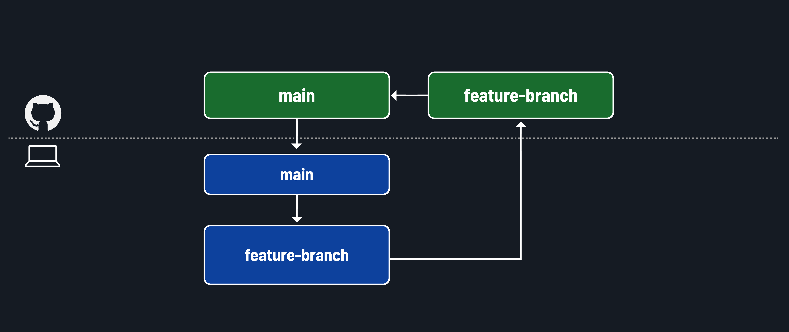

# Intro to Git and GitHub - Merge Code Locally

**Learning objective:** By the end of this lesson, students will be able to modify local code by integrating code from remote repositories following GitHub flow.

## Merging locally



There is one more action we need to take after we merge the pull request. We need to pull the changes made in the `main` branch of the remote repository to our local repo's `main` branch.

First, return to your terminal in VS Code. Then, checkout the `main` branch:

```bash
git checkout main
```

We'll use the `git pull` command to bring code from a remote repo into our local repo. It has this base signature:


1. The `git` command is necessary to carry out actions using Git on the command line.
2. The `pull` subcommand updates a local repository.
3. The URL of the remote repository, or more commonly, the friendly name of the remote repository in place of `<remote-repo>`.
4. The branch to pull from the remote repository in place of `<branch>`. If any code in the local branch conflicts with the remote branch, there will be merge conflicts. You will need to resolve those before continuing your work.

In your terminal, run the following command now to pull the `main` branch of the `my-project` repo on GitHub into your local `main` branch:

```bash
git pull origin main
```

Your local `main` branch will now contain the same code as the `main` branch of the remote repository. We've completed a cycle of GitHub flow! When you're ready to add another feature, start the process over by creating a new branch.

Here's a summary of a complete cycle of GitHub flow:


1. Pull code from the main branch of the GitHub repo.
2. Create a new branch.
3. Checkout into the new branch.
4. Write code features.
5. Add, commit, and push your code to a new feature branch on GitHub.
6. Create a pull request on the `main` branch when the feature is complete.
7. Merge the pull request into the main branch.