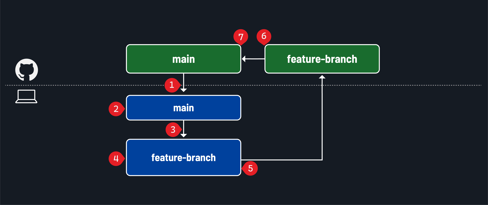
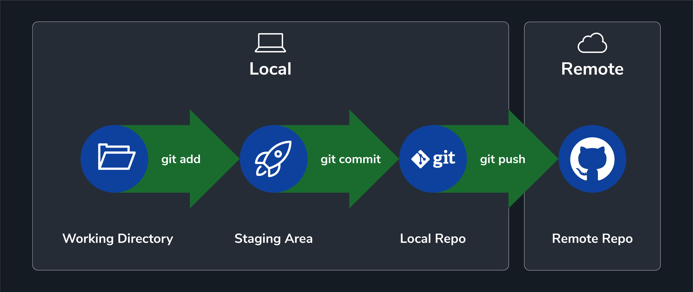
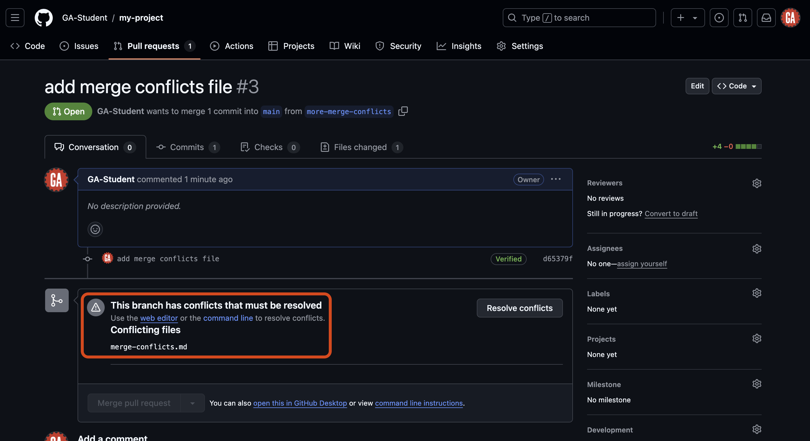
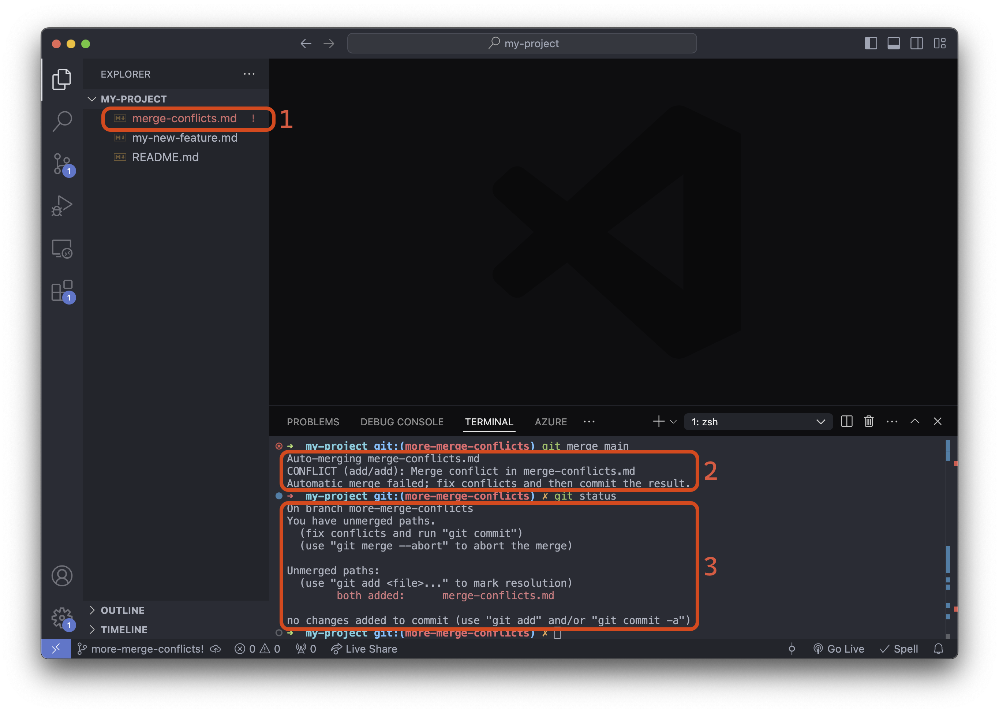
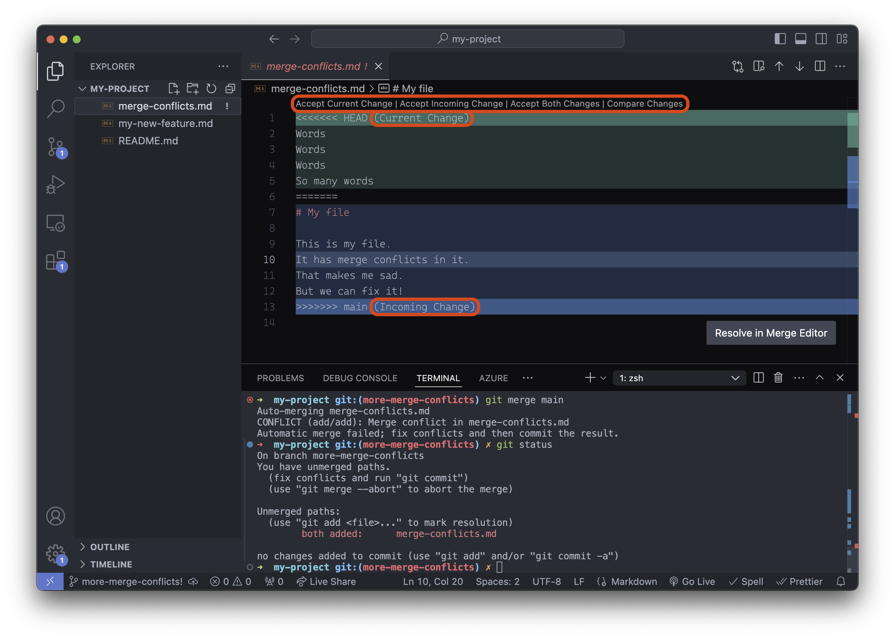
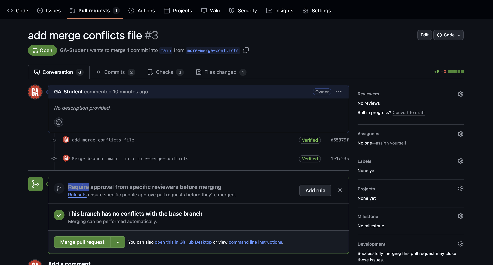

# Intro to Git and GitHub - Handling Merge Conflicts

**Learning objective:** By the end of this lesson, students will understand how merge conflicts are created and how to resolve them.

## Merge conflicts

So, what is a merge conflict? A merge conflict happens when Git cannot automatically merge the changes from one branch into another. This can occur when two branches have changed the same line of code.

> 🧠 It is ***much*** easier to prevent merge conflicts than fix them.

There are concrete actions you can take to help prevent merge conflicts from happening at all:

- Make frequent and small commits and pull requests focused on specific features.
- Work in a single branch at a time.

<div class="activity solo-exercise">
  <h2 class="title">Create a merge conflict</h2>
  <span class="minutes">25 min</span>
</div>

Nothing we've done so far should have caused a merge conflict. So we'll need to create one. This will also be an excellent opportunity to practice the GitHub flow. You'll follow these steps twice to complete this activity:



1. Pull code from the main branch of the GitHub repo.
2. Create a new branch.
3. Checkout into the new branch.
4. Write code features.
5. Add, commit, and push your code to a new feature branch on GitHub.
6. Create a pull request on the `main` branch when the feature is complete.
7. Merge the pull request into the main branch.

Some guidance is provided below to help guide you through these steps.

### Create a new branch

Return to this project in VS Code and open the terminal.

Start in your `main` branch if you're not already there:

```bash
git checkout main
```

Create a new branch:

```bash
git branch merge-conflicts
```

And checkout that branch:

```bash
git checkout merge-conflicts
```

### Write and commit code

Create a file called <code class="filepath">merge-conflicts.md</code>:

```bash
touch merge-conflicts.md
```

Add some appropriate text to the first few lines of this file. Keep it random gibberish

> 💡 Multiple branches working in the same file and adding conflicting text on the same lines will cause merge conflicts!

Commit your changes:

```bash
git add -A
git commit -m "add merge conflicts file"
```

### Push the branch to GitHub



Push the newly created branch to the remote repository:

```bash
git push origin merge-conflicts
```

Create a pull request. Use the branch you just pushed as the compare branch and the `main` branch as the base branch.

Repeat all of the above steps one more time, but use a different branch name of your choice.

After you've created two pull requests using separate branches, stop here. We'll continue together.

## Merge a pull request

After submitting two pull requests, merge one of those pull requests.

The first pull request should merge without any problems. When it is merged, no code will exist in the `main` branch of the remote repository that conflicts with any pull requests.

However, the other pull request can't be merged after the first pull request has been merged. This is because the pull request now contains code that conflicts with code in the `main` branch. When you go to the pull request, a message will state the pull request has merge conflicts, as outlined in red below:



Before the branch can be merged, these conflicts must be resolved.

## Fixing merge conflicts

So what now? How do you fix merge conflicts?

Conflicts can often be resolved in the browser, but sometimes, you must return to VS Code to fix the issues.

Follow the steps below to resolve the merge conflict.

Checkout the `main` branch:

```bash
git checkout main
```

Then, pull the code from the `main` branch of the remote repo:

```bash
git pull origin main
```

Your local `main` branch will now contain the same code as the `main` branch of the remote repository.

Checkout the existing feature branch that can't be merged because of the conflicting code inside of it:

```bash
git checkout <feature-branch-name>
```

> 🚨 Replace `<feature-branch-name>` (including the `<` and `>`) with the name of the branch that can't be merged because of the conflicting code in it.

Bring the latest code into the feature branch so that you can use it:

```bash
git merge main
```

This command brings the changes in the main branch into your feature branch. Or it would, but you'll notice there is an error in your terminal:

```plaintext
Auto-merging merge-conflicts.md
CONFLICT (add/add): Merge conflict in merge-conflicts.md
Automatic merge failed; fix conflicts and then commit the result.
```

Our merge conflict has now made its way to our local repo, where we can fix it.

The error message points out a merge conflict in the <code class="filepath">merge-conflicts.md</code> file. To proceed, we must fix those conflicts and commit the result.

Before continuing, take a quick breather. Merge conflicts can be tricky to resolve. Take your time and make sure you understand the changes that are in conflict. Running `git status` along the way will show you the files with a merge conflict. You can also see files with conflicts in the VS code user interface. These tools will help you keep track of the files you need to resolve.

Before going any further, close any open file tabs in VS Code, run the `git status` command, and let's observe what we see.



1. **File explorer**: The VS Code file explorer marks any file with merge conflicts using red/orange text and an `!` to the right of the file name.
2. **Merge error message**: Informs us that the automatic merge failed and the specific files it failed for.
3. **The output of `git status`**: Informs us we have unmerged paths (the merge was unsuccessful).

Great, we identified where the problem lies; let's open the <code class="filepath">merge-conflicts.md</code> file:



VS Code is helping us here. There are buttons above line 1 that are shortcuts to resolving this conflict. We can quickly accept the current change, accept the incoming change, or accept both changes. You can also take a more nuanced approach and change the text directly to resolve the conflict manually.

A merge conflict will always be broken down into the following parts:

- **Incoming Changes** - These are the changes coming in from the compare branch.
- **Current Changes** - These are the changes currently in the base branch.

The incoming changes will always be between the `<<<<<<< HEAD` and `=======` conflict markers.

The current changes will always be between the `=======` and `>>>>>>> compare-branch` conflict markers.

Resolve the conflicts by reviewing the file's contents and deciding which changes to keep. In some cases, you may want to keep both changes. Once you have decided on the changes, remove the conflict markers.

> 🚨 Be cautious about the changes made here - sometimes, this process can introduce bugs into your code that you must resolve manually!

After you've resolved the merge conflict, you should add, commit, and push the branch to GitHub. You should now be able to merge the pull request!



Congrats, that was quite the process! 🎉