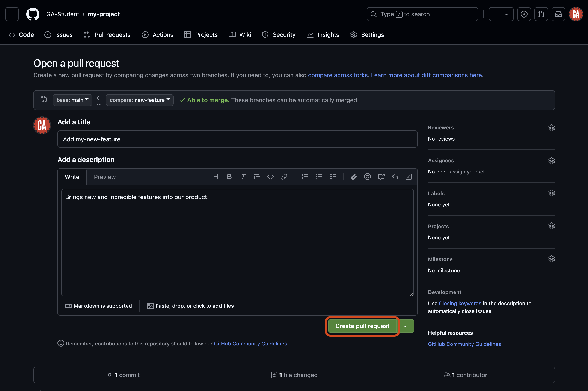

# Intro to Git and GitHub - Cheat Sheet

## Intro

This document provides a GitHub collaboration cheat sheet for those using the single-repo collaborator method to collaborate on a project.

Note that there is very little explanation for what the commands/actions in this document specifically accomplish - refer back to the main lecture content for more thorough details.

Use the table of contents below to go to the section you need quickly.

## Content

- [Setup (once for each project)](#setup-once-for-each-project)
  - [Create a GitHub repository](#create-a-github-repository)
  - [Clone the repo](#clone-the-repo)
  - [Open the project in VS Code](#open-the-project-in-vs-code)
- [Working in branches](#working-in-branches)
  - [Create and checkout a branch](#create-and-checkout-a-branch)
  - [Write code](#write-code)
  - [Push to the remote repo](#push-to-the-remote-repo)
- [Creating a pull request](#creating-a-pull-request)
  - [Comparing changes](#comparing-changes)
  - [Open a pull request](#open-a-pull-request)
- [Merging remotely](#merging-remotely)
- [Merging locally](#merging-locally)

## Setup (once for each project)

### Create a GitHub repository

Create a new ***public*** repository on [GitHub](https://github.com/) with a name of your choice.

***Important***: The repository should have some content. If making a new repository, initialize it by adding a README file.

### Clone the repo

Open your Terminal application, and clone the repo to your device into an appropriate location with the `git clone` command:

```bash
git clone https://github.com/<github-username>/<repo-name>
```

> 🚨 Do not copy the above command. It will not work. Your username will replace `<github-username>` (including the `<` and `>`) in the URL above. The name of the repo will replace `<repo-name>` (including the `<` and `>`) in the URL above.

### Open the project in VS Code

Navigate into the new directory and open it in VS Code:

```bash
cd <repo-name>
code . 
```

> 🚨 Do not copy the above command. It will not work. The name of the repo will replace `<repo-name>` (including the `<` and `>`) in the URL above.

## Working in branches

This is where the GitHub collaboration workflow begins. This step and the ones after it are ones you will complete repeatedly throughout a project. Your project should be open in VS Code.

### Create and checkout a branch

Open the VS Code terminal, and ensure you are in the root of the cloned repository directory.

Ensure you are in the `main` branch and have the most up-to-date code from the remote repository. You may need to commit the code in your current branch before you can switch to it.

```bash
git checkout main
git pull origin main
```

Modify the below command and run it:

```bash
git branch <new-feature>
```

> 🚨 Replace `<new-feature>` (including the `<` and `>`) in the above command with an appropriate name for this branch. Anything concise that identifies the work being added will work great.
>
> From now on, we'll refer to this branch as `<new-feature>` - remember that `<new-feature>` will be different for you, and you should use the value you have chosen instead of this name. You must adjust this value when you use commands from this guide.

Because we were in the `main` branch when we created the new branch, it will be made using the `main` branch as the starting point.

> 🚨 When using GitHub flow, You will ***never*** write code in the `main` branch of a repository. You will still interact with the `main` branch but not write code there.

To switch to the new branch, use the below `checkout` command after modifying it:

```bash
git checkout <new-feature>
```

### Write code

Write code as you normally would.

Stage and commit the changes:

```bash
git add -A
git commit -m "meaningful commit message"
```

Replacing `meaningful commit message` with an actual commit message.

### Push to the remote repo

We need to push the branch to the remote repository to make it available on GitHub. In your terminal, run the following command after modifying it:

```bash
git push origin <new-feature>
```

If you go to the repository on GitHub, you will see that there is now a `<new-feature>` branch.


## Creating a pull request

There are many different methods to create a pull request on GitHub. The steps outlined below will ensure a repeatable and consistent experience in as few steps as possible.

You will need:

- Your GitHub username.
- The name of the repository you're working in.

Navigate to this URL after making the necessary changes to it:

```plaintext
https://github.com/<github-username>/<repo-name>/compare
```

Replacing `<github-username>` (including the `<` and `>`) with the GitHub manager's GitHub username and `<repo-name>` (including the `<` and `>`) with the repository name.

> 💡 When working on a project for a prolonged period, it is wise to bookmark this page for easy access!

You should arrive at a page similar to the one shown below.


### Comparing changes

When you navigate to the pull request page, you will see the `Comparing changes` section. This section is where you will select the branches you want to compare. Two dropdowns in this section allow you to choose the base branch and the compare branch.

- **Base branch** - This is the branch you want to merge your changes into. This is typically the `main` branch.
- **Compare branch** - This is the branch you want to merge into the base branch. This is typically the feature branch you have been working on. In our case, it is `<new-feature>`. Note the arrow going from the compare branch to the base branch - this indicates the flow of your code.

You can see these dropdowns outlined in red in the screenshot below.


Select the **compare** dropdown, and select the branch you want to compare to the `main` branch. This is outlined in red in the screenshot below (although the branch name you want to compare to the `main` branch will be different). Note the search feature here - it may be necessary to use this when more branches are made in a repo.


After selecting a branch, you'll see the changes made if the pull request is merged. After you review the changes, select the **Create pull request** button outlined in red below.


### Open a pull request

You'll be taken to a new page where you can open your pull request. Here, you will give your pull request a title and summary.

After setting up the title and description and selecting the branches you want to compare, select the **Create pull request** button as outlined in red below. This will create the pull request and take you to the pull request page.



## Merging remotely

You'll be taken to the new pull request you just created.


> 💡 You can view all the open pull requests for a repo at this address (after modifying it):
>
> ```plaintext
> https://github.com/<github-username>/<repo-name>/pulls
> ```
>
> Replacing `<github-username>` (including the `<` and `>`) with the GitHub username of the repo owner and `<repo-name>` (including the `<` and `>`) with the repo name.

Review the pull request. If changes need to be made (for example, if there are merge conflicts), make those changes before you complete the merge.

If everything looks good, select the **Merge pull request** button.

## Merging locally

There is one more action we need to take after we merge the pull request. We need to pull the changes made to the `main` branch of the remote repository into our local repo's `main` branch.

First, return to your terminal application or VS Code.

Checkout the `main` branch:

```bash
git checkout main
```

Then, pull the code from the `main` branch of the remote repo:

```bash
git pull origin main
```

Your local `main` branch will now contain the same code as the `main` branch of the remote repository.

This completes our cycle. From here, you can return to the [Working in branches](#working-in-branches) section and follow the guide from there for every new feature you add.