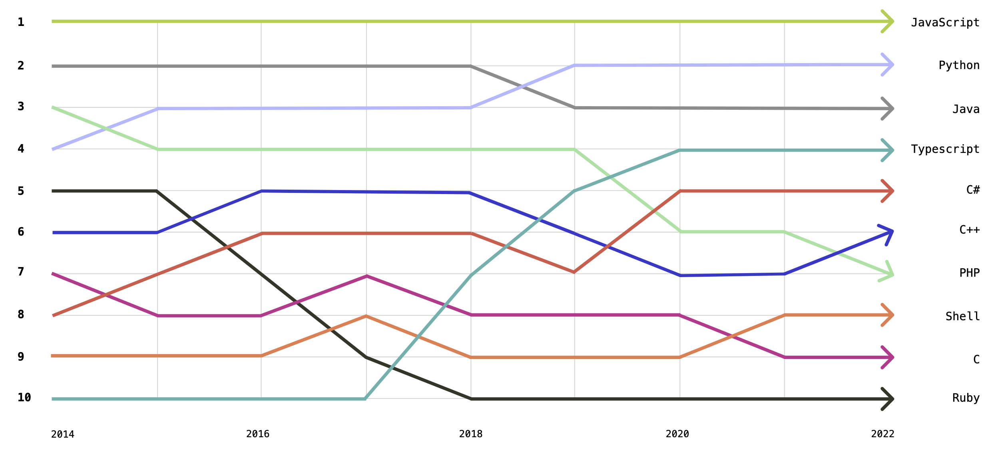
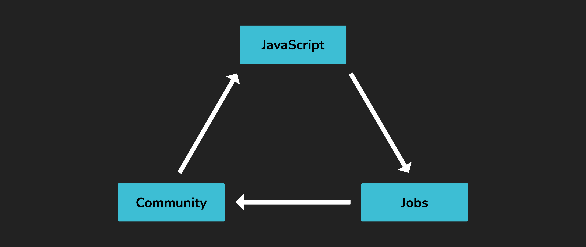
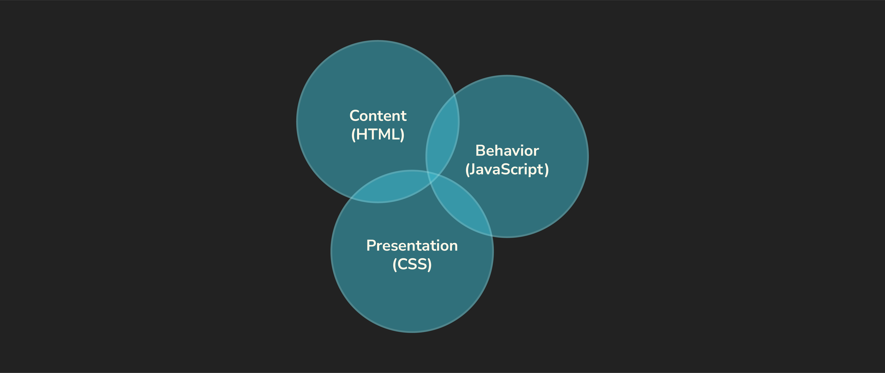

# Intro to JavaScript - Concepts

**Learning objective:** By the end of this lesson, students will be able to describe the role of JavaScript in web development and its significance in both client-side and server-side applications.

## What is JavaScript?

[JavaScript](https://developer.mozilla.org/en-US/docs/Web/JavaScript) (commonly abbreviated as JS) is a powerful and versatile programming language. It was created primarily to enhance web pages by making them interactive. It is a high-level language, meaning developers don't need to manage system-specific details as we write it.

JavaScript is the only programming language used directly in web browsers. This alone has made it increasingly popular as web-based applications have become more common. Its ubiquitous use in the browser has also fueled its proliferation out of the browser and into server, mobile, and desktop applications. 

These attributes have all fueled JavaScript's explosive growth and sustained popularity through time. The following graph shows the top languages on GitHub since 2014, where JavaScript has steadily held the top position. When you visit a website in your browser, it almost always uses JavaScript in some form or fashion.

## Why use JavaScript?

There are a lot of reasons to learn JavaScript, including:

- It's necessary for web development but also a versatile language that can do much more.
- It's system and environment agnostic. This means it doesn't require a lot of resources to run.
- It's under active development. New improvements and features are still added to JavaScript annually.
- It's community support. If you're trying to accomplish something in JavaScript, someone has likely built a tool to help you achieve that task more efficiently.

These reasons funnel into another important factor: jobs. As more job positions are filled, the community continues to grow, the usefulness of JavaScript expands, and even more job positions are created.

## JavaScript's role in web applications

JavaScript, along with HTML and CSS, is one of the three essential technologies used to create web apps. HTML defines the structure and content of a web page. CSS controls how the page is styled and presented. JavaScript adds interactivity and behavior.

