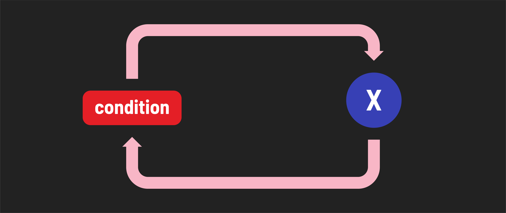

# JavaScript Control Flow - Concepts

**Learning objective:** By the end of this lesson, students will understand the three types of control flow and their importance in programming.

## What is control flow? 

Control flow in programming refers to the way we manage the order in which code is executed within a program. It's like having a set of instructions and deciding when and how to follow them. Control flow becomes crucial when we want our program to behave differently based on certain conditions or user input. But how do we make those decisions and integrate them into our code?

Think of control flow in JavaScript as a traffic light at an intersection. Just as a traffic light regulates the movement of vehicles, pedestrians, and cyclists at a crossing, control flow in code regulates the sequence of actions and decisions that our program takes.

So how do we implement this type of control?

### Basic types of control flow

There are several methods for directing how and when our code executes. 

**Sequence:** Statements execute one at a time in succession. This is the default behavior.
 

**Branching:** Different code paths are executed based on a conditional expression.
 

**Looping:** The code in the loop repeatedly executes while a condition is truthy.
 

## Why is control flow important? 

By default, when you run a program, it starts executing from the top line of code and continues sequentially until it reaches the last line. This linear execution doesn't align with the needs of most applications. In reality, we often need to change or manipulate the order of execution to achieve specific goals, such as:

**Decision-Making:** Sometimes, we need the program to make choices and execute different code paths based on conditions. For example, showing different messages to users based on their input.

**Repetition:** Many tasks involve performing the same actions multiple times. Control flow allows us to create loops to repeat a set of instructions until a certain condition is met.

**User Interaction:** Applications often respond to user actions. Control flow lets us manage these interactions, triggering specific actions when users click buttons, enter data, or perform other actions.

**Error Handling:** Handling errors gracefully is essential. Control flow helps us navigate errors by directing the program to take specific actions when something goes wrong.

In essence, we don't always want our code to run straight from top to bottom. Control flow is the fundamental mechanism that enables us to shape the behavior of our programs, making them smart and adaptable to various scenarios.