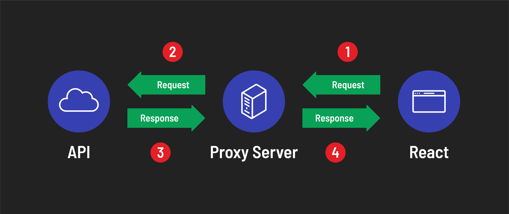
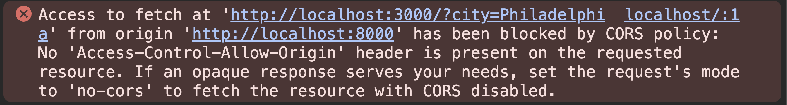
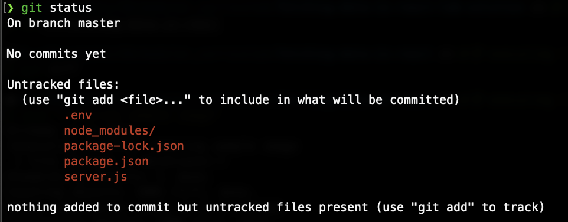
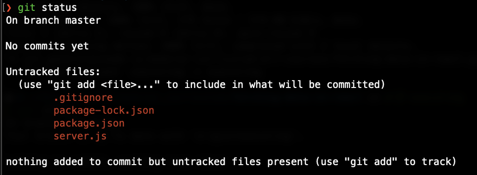

# Fetching Data in React - Securing API Keys

# Why should we secure API Keys?
API keys are essential for secure communication between your application and an API. They authenticate your app, control access, and track usage. Keeping API keys secure is crucial because they are a significant security component.

Consider this scenario: you’re developing an app and accidentally leave your API key in the code. If you upload this code to a public platform like GitHub, someone could find and use your API key without your knowledge. This could have several consequences:

* **Exceeding usage limits**: If the API has daily request limits, the unauthorized person could exhaust these, preventing your app from functioning correctly.
* **Incurring costs**: If the API charges per request and the key is linked to your credit card, you could face unexpected charges.

Even without sharing your code, deployed apps can be vulnerable if API keys are not properly secured. In this lesson, we’ll explore effective methods to protect your API keys from unauthorized access and misuse.

## Proxy servers
The easiest way to hide your API keys is to create a proxy server, which is just a web server application that makes requests to the API. Here’s how the flow of requests/responses would go:

1. Your React application makes a request to the proxy server you’ve created.
2. The proxy server, in turn, makes a request to the API.
3. The API responds with data to your proxy server.
4. Your proxy server responds to your React application with the data it just received from the API.



Why is this helpful? Because we can use a `.env` file to hide the API key when writing our proxy server app. This way, instead of having your React app make requests to:

```
http://api.weatherapi.com/v1/current.json?key=93926e8f19954ff8892185839241302&q=Philadelphia
```

Your React app would make a request to:

```
http://localhost:3000/?city=Philadelphia
```

Notice that there’s no API key in the 2nd request. Your React code can be pushed to GitHub without giving away your API key.

As you’ll see in this lesson, we’ll use a `.env` file to store the API key in our proxy server. We’ll then tell Git to ignore the `.env` file using a `.gitignore` file. Once this is complete, our proxy server code will also be safe to push to GitHub.

## Initializing the proxy server app
**NOTE:** Have your Fetching Data in React Weather Application open and your dev server running.

Go into `~/code/ga/lectures` and create a new directory called `proxy-server-example`:

```bash
cd ~/code/ga/lectures
mkdir proxy-server-example
```

`cd` into that directory and create a `server.js` file:

```bash
cd proxy-server-example
touch server.js
```

Now, initialize a Node.js project and install Express.

```bash
npm init -y
npm install express
```

In `server.js`, initialize a new Express app:

```js
const express = require('express');
const app = express();

app.listen(3000, () => {
  console.log('listening on port 3000...');
});
```

Start the server by running `nodemon` in the terminal and test out `http://localhost:3000/` in the browser. You should see “Cannot GET /”

## Creating a route
Now, let’s create a route that our React app will make requests to:

```js
// server.js

// Add your API_KEY:
const API_KEY = '<YOUR_API_KEY_HERE>';
// Define a BASE_URL that includes the API_KEY:
const BASE_URL = `http://api.weatherapi.com/v1/current.json?key=${API_KEY}`;

app.get('/weather/:city', async (req, res) => {
  const { city } = req.params; // Destructure city from req.params
  const queryString = `&q=${city}`; // Create a queryString using city
  const apiRes = await fetch(BASE_URL + queryString); // Make the fetch request
  const data = await apiRes.json(); // Parse the response
  res.json(data); // Respond to the request with the data
});
```
> Note: In the code above, there is a response coming back from the Weather API and a response that your Express app will send to your React app. Make sure your variables are named appropriately so that you can differentiate them.

If you go to `http://localhost:3000/weather/seattle` in the browser, you should see the data that your proxy server retrieves from the API.

## Updating the React AJAX URL
Next, we’ll need to return to our React weather application to change the URL the app is making a request to.

First, update the `BASE_URL`:

```js
// src/services/weatherService.js

const BASE_URL = `http://localhost:3000/weather/`;
```

Next, update what is being passed to the `fetch()` method:

```js
// src/services/weatherService.js

const show = async (city) => {
  try {
    const res = await fetch(BASE_URL + city);
    const data = await res.json();
    console.log('Data:', data);
    return data;
  } catch (err) {
    console.log(err);
  }
};
```

Be sure to delete the following line of code from your React app:

```js
// src/services/weatherService.js

const API_KEY = '<YOUR_API_KEY_HERE>';
```

Now, your React code is nice and secure!

But wait! If you test this, the React app should break. You should see errors in the console about how your AJAX request was blocked by “CORS policy” with an error message that looks something like this:



Don't worry, we'll solve that next.

## Setting up CORS
Note that your React app is running on port `5173`, and your new proxy server is running on port `3000`. This is good! Each port can only have one application listening on it. The problem is that it’s considered insecure for browsers to make AJAX requests to other domains or ports (this is called Cross-Origin Resource Sharing or CORS).

So even though both React and your proxy server are accessed via `localhost` because they’re on different ports, having your React app make an AJAX request to your proxy server is considered insecure. This can be fixed, though!

Install the `cors` NPM package for your proxy server:

```bash
npm install cors
```

Now `require` it in your express app:

```js
// server.js
const cors = require('cors');
```

Because the `cors` package is an express middleware package, let’s use it by mounting it above our `/` route handler:

```js
// server.js
app.use(cors());
```

Doing this tells our Express app to allow requests from other domains and ports. Test your React app, and you should see now that it works again. Yay!

## Hiding the API with our key
We’re almost done! The next step is hiding our API key, which is still visible in our Express code. Not secure! Let’s hide it in a `.env` file. First, install the `dotenv` package:

```bash
npm i dotenv
```

Now initialize it at the top of our Express app:

```js
require('dotenv').config();
```

Create the `.env` file:

```bash
touch .env
```

Now create an environment variable inside our `.env` file and paste the key from your Express app:

```js
API_KEY=<YOUR_API_KEY_HERE>
```

Now, you can use `process.env.API_KEY` in your Express app to place the API key inside the `BASE_URL` request like so:

```js
// server.js

const BASE_URL = `http://api.weatherapi.com/v1/current.json?key=${process.env.API_KEY}`;
```

Your React app should work if you test it.

## Ignoring the `.env`
Now that your API key is in the `.env` file, we should ensure that Git doesn’t track that file and make the contents of it available for others to see. If your Express app directory isn’t already a Git repo, we can initialize it like so:

```bash
git init
```
If we run `git status`, we should see something like the following:



Create the `.gitignore` file by running the following:

```bash
touch .gitignore
```

Now edit `.gitignore` to ignore the `.env` file (and while we’re in there, we might as well ignore the `node_modules` directory - this keeps repository sizes manageable and our Git operations efficient):

```js
.env
node_modules
```

Now, when you run `git status`, you should see the following:



That’s it! Now your API key is securely hidden.