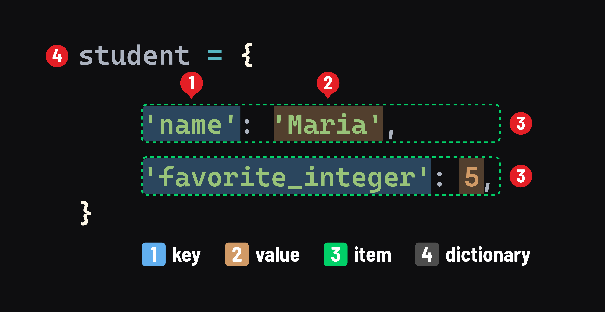

# Python Data Structures - Dictionaries

## What are dictionaries?
***Dictionaries*** in Python are similar to ***objects*** in JavaScript. Dictionaries are collections of ***items***, like objects, which are collections of ***properties*** in JavaScript.

Dictionaries have a class (type) of `dict`.

## Basic syntax
As with objects in JavaScript, a dictionary literal is created using curly braces:



1. A key
2. A value
3. An item - or a `key: value` pair
4. The dictionary itself

Any immutable type (like a number) can be used as a key. Unlike in JavaScript, when strings are used as keys, they must be surrounded in quotes, as they are above. The value held by a variable can also be used as a key - this is a common pitfall for JavaScript developers new to Python:

```py
favorite_animal = 'dog'

student = {
    'name': 'Maria',
    'favorite_integer': 5,
    favorite_animal: 'llama' # notice the lack of quotes around favorite_animal
}

print(student)
# prints: {'name': 'Maria', 'favorite_integer': 5, 'dog': 'llama'}
# note the 'dog' key - the value of the favorite_animal variable is used
```

## Accessing items in dictionaries
### Getting values
We use square brackets to get an item’s value:

```py
name = student['name']
print(name)
# prints: Maria
```

Unlike JavaScript, we can’t access items in a Python dictionary using dot notation (dots are exclusively used to invoke methods on a dictionary in Python).

### The `get` method
When attempting to access a key that does not exist in a dictionary, a `KeyError` will be raised.

One option to avoid this error is to use the `get` method:

```py
favorite_food = student['favorite_food']
# error: KeyError: 'favorite_food'

print(student.get('favorite_food'))
# prints: None
```

### The `in` operator
Another way to avoid the `KeyError` is to use the in operator to check if the dictionary includes a key:

```py
if 'course' in student:
    print(f"{student['name']} is enrolled in {student['course']}")
else:
    print(f"{student['name']} is not enrolled in a course")
    # prints: Maria is not enrolled in a course
```

## Mutation
Dictionaries are mutable:

- The values assigned to a key can be changed.
- Additional items can be added.
- Existing items can be deleted.

### Setting items
We not only use square brackets to get an item’s value - we also use it to set an item’s value:

```py
student['name'] = 'Mariana'
print(student['name'])
# prints: Mariana
```

### Adding items
Assigning to a ***key*** that does not exist will create a new item in the dictionary.

Let’s add an item to the `student` dictionary:

```py
student['age'] = 25
```

### Deleting items
The `del` statement is used to delete an item from a dictionary:

```py
del student['dog']
# verify that the item was deleted
print('dog' in student)
# prints: False
```

## Number of items
Use the built-in `len` function to retrieve the number of items in a dictionary:

```py
print(student)
# prints: {'name': 'Maria', 'favorite_integer': 5, 'age': 25}
print(len(student))
# prints: 3
print(len({}))
# prints: 0
```

## Iterating through dictionaries
`for` loops are used to iterate over the items in a dictionary.

However, accessing the value of an item as follows is considered to be a Python [anti-pattern](https://en.wikipedia.org/wiki/Anti-pattern):

```py
for key in student:
    print(f"{key} is {student[key]}")
    # prints:
    # name is Maria
    # favorite_integer is 5
    # age is 25
```

Modifying a dictionary using this approach can lead to potential issues, which is why this is not preferred.

The preferred approach is to use the `items()` method to obtain a dictionary view object.

Use it in a `for in` loop to iterate over the view object:

```py
for key, val in student.items():
    print(f"{key} is {val}")
    # prints:
    # name is Maria
    # favorite_integer is 5
    # age is 25
```

The for statement assigns values to multiple variables like with `key, val` above through a mechanism called tuples, discussed later.

## 🎓 You Do
1. Define a Python dictionary named `where_my_things_are` containing a few items where:
    - the `keys` are things you have
    - the `values` are the locations where you keep those things
2. Write a `for` loop that iterates over the items in the dictionary and prints each one as:

***My [thing] is kept [location]***