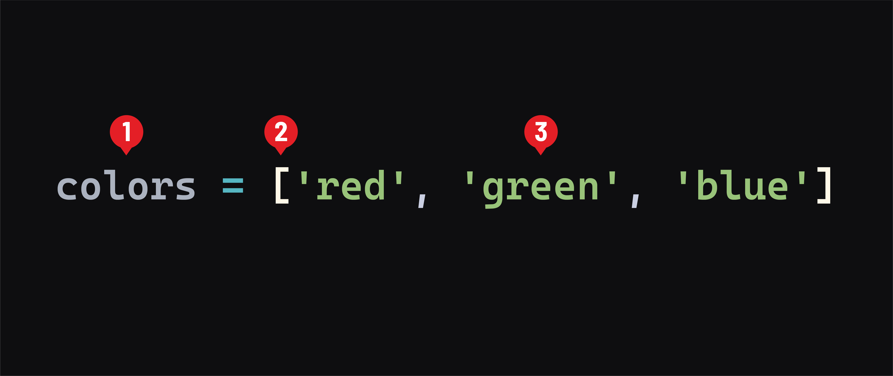

# Python Data Structures - Lists

## What are lists?
***Lists*** serve the same function in Python as ***arrays*** do in JavaScript. A list holds zero or more items called ***elements*** - just like arrays in JavaScript.

Lists can contain any data type - strings, integers, dictionaries, nested lists, and so on. They grow and shrink in size dynamically. You can add to them without being concerned about their capacity. They have a class (type) of `list`.

## Basic syntax
Like arrays in JavaScript, a list can be created with a set of square brackets:



1. The name of the list. This should be plural because it holds a collection of elements.
2. Opening and closing square brackets indicate a list.
3. The list’s elements are placed inside the square brackets, separated by a comma. When initializing a list, you don’t have to include elements; use a set of empty square brackets - `[]`.

Lists are considered a *sequence* type in Python.

> 📚 A *sequence* is a generic term for an ordered collection. Other sequence types in Python include strings and tuples.

Like JavaScript arrays, Python lists use zero-based indexing, meaning that the first element in the list is at index position `0`.

## Accessing items
Accessing the individual items of a list is much like accessing elements in a JavaScript array. Use square brackets with an expression that evaluates to an integer to access the element at that index:

```py
print(colors[0])
# prints: red
```

However, unlike in JavaScript, we can use negative integers to index from the end of a list:

```py
print(colors[-1])
# prints: blue
```

This means you don’t need to get the length of a list (for example, with `len(colors)`) to find the end of a list. There’s no need to write code like `colors[len(colors) - 1]` - yay!

## Mutation
Lists are mutable:

- Existing items within a list can be replaced.
- Additional items can be added to the list.
- Existing items can be removed from a list.

### Assigning items
We also use square brackets to target an item of a list for assignment:

```py
colors[-1] = 'brown'
print(colors)
# prints: ['red', 'green', 'brown']
```

Unlike with JavaScript arrays, assigning to a non-existing index results in an error:

```py
colors[10] = 'yellow'
# error: IndexError: list assignment index out of range
```

### Adding an item
The equivalent to JavaScript’s `push()` method is `append()`:

```py
colors.append('purple')
print(colors)
# prints: ['red', 'green', 'brown', 'purple']
# purple was added to the end of the list
```

However, unlike JavaScript’s `push()` method, `append()` can only add one item and does not return a value.

For adding multiple items, use the `extend()`:

```py
colors.extend(['orange', 'black'])
print(colors)
# prints: ['red', 'green', 'brown', 'purple', 'orange', 'black']
# orange and black were added to the end of the list
```

### Inserting an item
To add an item anywhere within a list, use the `insert()` method:

```py
colors.insert(1, 'yellow')
print(colors)
# prints: ['red', 'yellow', 'green', 'brown', 'purple', 'orange', 'black']
# yellow was added at the 1 index; no elements were replaced
```

### Removing an item
Python lists have a `pop()` method, but it’s more flexible in Python because you can specify the index of the item to remove and return:

```py
green = colors.pop(2)
print(colors)
# prints: ['red', 'yellow', 'brown', 'purple', 'orange', 'black']
# green was removed at the 2 index and is in the green variable
```

There’s also a `remove()` method that removes the first item that matches what you pass in:

```py
colors.remove('orange')
print(colors)
# prints: ['red', 'yellow', 'brown', 'purple', 'black']
```

No value is returned by the `remove()` method.

## Clearing an entire list
The `clear()` method empties a list:

```py
colors.clear()
print(colors)
# prints: []
```

## Iterating over items in a list
The `for in` loop is used to iterate over the items in a list:

```py
colors = ['red', 'green', 'blue']
for color in colors:
    print(color)
    # prints:
    # red
    # green
    # blue
```

If we need to access the index of the item while iterating over a list, we use the built-in `enumerate()` function to provide the index and the value to a `for` loop:

```py
for idx, color in enumerate(colors):
    print(idx, color)
    # prints:
    # 0 red
    # 1 green
    # 2 blue
```