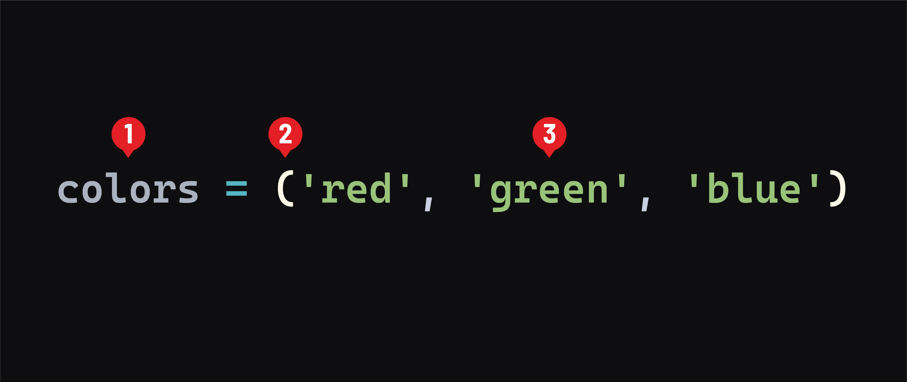

# Python Data Structures - Tuples 

## What are tuples?
***Tuples*** in Python are very similar to Python ***lists***. They can be pronounced as either tuh-pull or two-pull. No matter how you pronounce it, someone will be mad at you, so pick one and ignore the haters. Even the creator of Python doesn’t hold a strong opinion either way.

A tuple can hold zero or more ***items***. Tuples can contain any data type and have a class (type) of `tuple`.

Tuples are commonly classified based on the number of items they contain. For example, a ***2-tuple*** would likely contain two items, such as `(key, value)`.

## Basic syntax
Tuples can be defined in a few different ways. Most basically, they are defined like this:



1. The name of the tuple. This should be plural because it holds a collection of elements.
2. Opening and closing parenthesis indicate a tuple. These are actually optional (except when creating an empty tuple). However, using parenthesis is popular convention.
3. The tuple’s items are placed inside the parenthesis, separated by a comma. When initializing a tuple, you don’t have to include elements; use a set of empty parenthesis - `()`.

If you need to create a 1-tuple (a tuple with one item), note that a comma is necessary:

```py
hello_tuple = ('Hello')
# this will not create a tuple
print(type(hello_tuple))
# prints: <class 'str'>

hello_tuple = ('Hello',)
# or just the following (remember parenthesis are not required)
hello_tuple = 'Hello',
print(type(hello_tuple))
# prints: <class 'tuple'>
```

## Differences between tuples and lists
The main difference between tuples and lists is that tuples are immutable.

Since tuples can’t be changed after being created, they are great for protecting data you don’t want to be changed.

Because they are immutable, tuples can even be used as keys for dictionaries.

Generally, you’ll find that tuples contain heterogeneous (different) data types and lists for homogeneous (similar) data types.

## Accessing items
Although tuples can’t be modified like lists, we can retrieve their items in the same way using square brackets:

```py
colors = ('red', 'green', 'blue')
print(colors[1])
# prints: green
```

Sequences (lists, tuples, and strings) also have an `index()` method that returns the index of the first match:

```py
colors = ('red', 'green', 'blue')
blue_idx = colors.index('blue')
print(blue_idx)
# prints: 2
```

## Iteration
The items in tuples are iterated over by using `for` loops, as we saw previously with lists:

```py
for idx, color in enumerate(colors):
    print(idx, color)
    # prints:
    # 0 red
    # 1 green
    # 2 blue
```

## Unpacking tuples
Tuples (and other sequences) have a convenient feature called unpacking. This performs multiple variable assignments in a single line of code:

```py
colors = ('red', 'green', 'blue')
r, g, b = colors
print(r, g, b)
# prints: red green blue
```

It requires comma-separated variables on the left side of the assignment operator and a sequence of values on the right. Functions and methods often return tuples in Python, which is often the preferred method of accessing them.

You’ve already seen this in action within the `for in` loops while working with dictionaries. Recall this example:

```py
for key, val in student.items():
    print( f"{key} is {val}" )
```

This demonstrates unpacking!