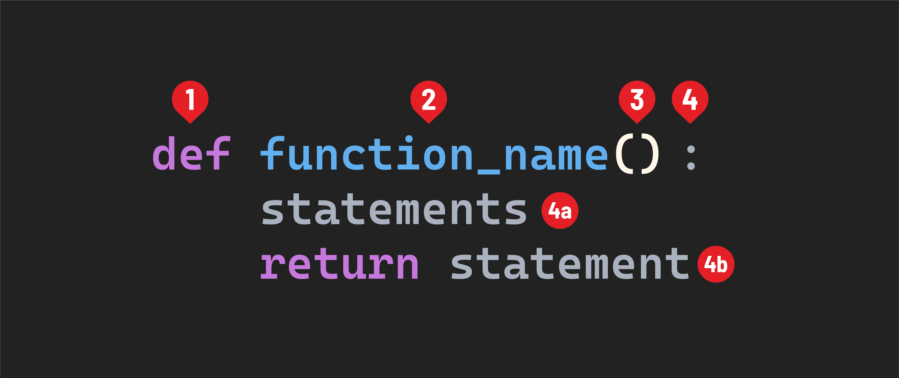

# Python Functions - Defining and Calling Functions 

## Function syntax
A function definition will have the following syntax:



1. The `def` keyword.
2. The name of the function. It should be written in `snake_case`.
3. The parameter list, inside parentheses.
4. The body of the function is indicated by a colon.
    - 4a. The statements that make up the function itself. These must be indented.
    - 4b. Optionally, a `return` statement.

## Defining a function
A basic function definition could look something like this:

```py
def do_nothing():
    pass
```

This function does nothing at all. You’ll recall in JavaScript, we can create empty functions by not including anything inside the body (`{ }`) of a function.

The `pass` statement doesn’t do anything. We’re using it here to ensure this function has at least one statement in its block. This is required in Python.

Here’s a function that does a little more:

```py
def print_banner():
    print("=======================")
    print("Insert banner text here")
    print("=======================")
```

This function logs three lines of text to the console.

## Calling a function
Just like in JavaScript, defining a function does not execute it. A function must be called for it to run.

If we wanted to call the `print_banner()` function from our previous example, we would do so like this:

```py
print_banner()
```
> 🚨 You cannot invoke a Python function before the code that defines the function. For example, this will not work:
>
>```py
>print_banner()
>
>def print_banner():
>    print("=======================")
>    print("Insert banner text here")
>    print("=======================")
>```
> Instead, do this:
>
>```py
>def print_banner():
>    print("=======================")
>    print("Insert banner text here")
>    print("=======================")
>
>print_banner()

Just like in JavaScript, functions are reusable, and we can call the same function more than once.

Also, like in JavaScript, all functions return something, even when we don’t specify something to return. When we don’t return anything from a function in JavaScript, it returns `undefined`. In Python, functions that we don’t specify a return for return `None`:

```py
print(do_nothing())
# prints: None
```

## Key differences between Python and JavaScript functions
Besides the noticeable syntactical differences, here are a few other things to be aware of:

### Function expressions do not exist in Python
Functions in Python are defined using the `def` keyword. However, unlike in JavaScript, you cannot define a function in Python by assigning it to a variable:

```py
# this does not work
my_function = def my_function():
    pass
```

### Python has a different sort of anonymous/inline function
Like JavaScript, Python has the concept of anonymous and/or inline functions. These are called lambda functions in Python and have a special syntax.

Lambda functions are very much like *arrow functions* in JavaScript:

- They implicitly return a single expression’s result.
- They can be assigned to a variable.

However, they cannot have any code blocks - only a single expression with its result implicitly returned.

For example, in JavaScript, we might have something that looks like this:

```js
const nums = [1, 3, 2, 6, 5];
let odds = nums.filter(num => num % 2);
```

This same behavior and functionality could be duplicated in Python:

```py
nums = [1, 3, 2, 6, 5]
odds = list(filter(lambda num: num % 2, nums))
```

Lambda functions are useful when using Python functions such as `map()`, just like how arrow functions are when using JavaScript’s array iterator methods.

Check out this [writeup](https://realpython.com/python-lambda/) and the [Python docs](https://docs.python.org/3/reference/expressions.html#lambda) for more details.