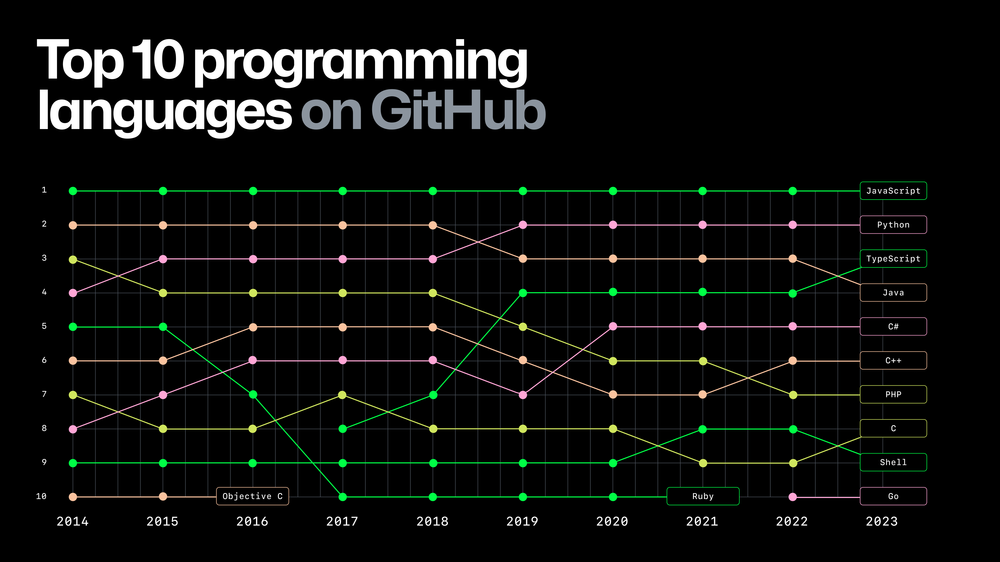

# Intro to Python - Concepts

## What is Python?
Python is a high-level, interpreted programming language known for its ease of use and readability. It was first released in 1991 to provide programmers with a way to write clear, logical code for small and large-scale projects.

Unlike JavaScript, which is primarily used in web development, Python boasts a wide range of applications, from web and software development to scientific computing, data analysis, native desktop applications, artificial intelligence, and automation.

Like JavaScript, its high-level nature means that developers can write applications without needing to worry about low-level details such as memory management, speeding up development. Also like JavaScript, Python is a dynamic scripting language that does not have to be compiled before it can be executed - it runs within an ***interpreter*** that handles the conversion into machine code.

Python’s simplicity and versatility have contributed to its widespread adoption in various fields, making it one of the most popular programming languages today. The following data from GitHub since 2014 illustrates Python’s steadily rising popularity, where it competes closely with JavaScript for the top position.

## Why use Python?
There are many reasons for learning and using Python:

- Versatility and Flexibility: Python is not just for web development; its use cases span different domains, making it a valuable tool for any developer.
- Ease of Learning and Readability: Python’s syntax is designed to be intuitive, lowering the barrier to entry for beginners. It often uses English keywords whereas other languages use punctuation or symbols. For example, the equivalent of JavaScript’s `&&` operator in Python is `and`. Unlike many other languages, it does not use curly braces to define blocks of code; instead, it uses indentation.
- Cross-Platform Compatibility: It runs on various systems without significant modifications, facilitating widespread use.
- Continuous Development: Python is an open-source language with a vibrant community. It receives regular updates and improvements, adding new functionalities and keeping it up-to-date with current tech trends.
- Robust Community and Libraries: With an extensive standard library and third-party modules on the [Python Package Index (PyPI)](https://pypi.org/) for nearly every task imaginable, Python’s ecosystem is rich and supportive. Whatever you’re trying to do, there’s a high chance that there’s already a library to help.

These aspects, coupled with the increasing demand for automation, data analysis, and web development skills, make Python a highly sought-after skill in the job market. The growth of its community and the expansion of its applications continue to open new job opportunities.

## Python’s Role in Technology and Development
Python is a cornerstone technology in many fields. While it does not serve the same role in web development as JavaScript, it is integral to backend development, data science, and the development of many types of software.

Frameworks like Django and Flask allow for the creation of robust web applications. Beyond the web, Python’s simplicity and the power of its popular libraries such as NumPy, Pandas, and TensorFlow make it indispensable for tasks in data analysis, machine learning, and artificial intelligence.

## Python 3 vs. Python 2
When Python 3 was released in 2008, it introduced several changes to fix fundamental design flaws and improve the language’s consistency. However, these changes were not backward-compatible with Python 2, leading to a significant division in the Python community. Python 2 was sunset on January 1, 2020, and is no longer receiving updates. Because of this, it should not be used.