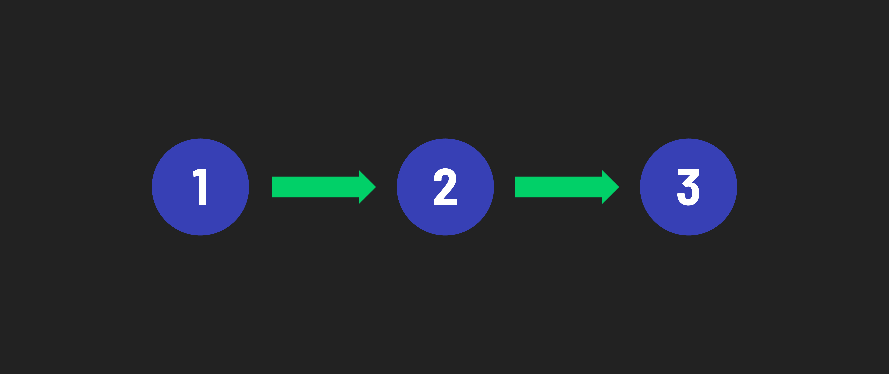
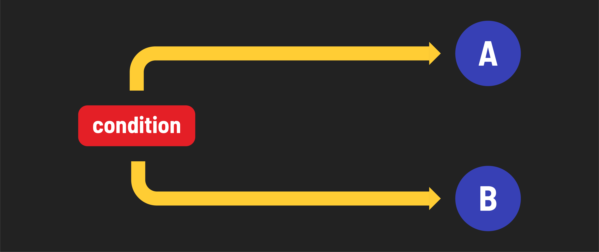

# Python Control Flow - Concepts

## Review of control flow
As you may recall, ***control flow*** refers to the order in which code executes in a program as determined by the use of constructs in the code.

There are three basic types of control flow: sequence, branching, and looping.

The most basic type of control flow is ***sequence***, which occurs when statements execute one at a time in succession. This is the default behavior.

In JavaScript, we saw how statements such as `if` and `switch` were used to perform **branching**. This is when different code paths are executed based on a conditional expression.

We also used statements such as `for` and `while` to perform ***looping***. The code inside a loop repeatedly executes while a condition is truthy.

Python, like most programming languages, shares these same control flow constructs. This similarity enables you to apply your existing knowledge of control flow from JavaScript to Python, making the transition smoother and your learning journey easier.

It’s worth pointing out that many programming concepts, such as variables, data types, control flow, functions, and so on, apply to programming languages in general. Thus, learning additional languages is far easier than learning the first one!