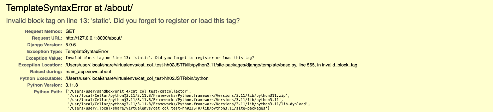
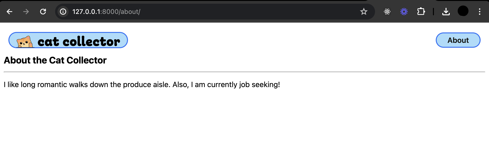

# Cat Collector - Including Static Files in Templates
**Learning objective**: By the end of this lesson, students will be able to link static files like CSS, JavaScript, and images in Django templates using the `` template tag.

## Static Files in Templates
As you know, web apps usually have static files such as `.css`, `.js`, image files, etc. If we want our Cat Collector app to look better, we're going to have to be able to define soem custom CSS. Django projects are pre-configured with a `'django.contrib.staticfiles'` app installed for the purposes of serving static files. 

At the bottom of `settings.py`, there is a `STATIC_URL = 'static/'` variable that tells Django to look for static files like CSS in a directory called "static/".

Let's create this directory in our `main_app`:

```bash
mkdir main_app/static
```

Next, let's create a directory within `static` dedicated to CSS:

```bash 
mkdir main_app/static/css
```

Now let's create a `base.css`:

```bash
touch main_app/static/css/base.css
```

For noww, just to make sure that `base.css` is properly loaded, let's add an eye catching bit of css:

```css
/* static/css/base.css  */

body {
  background-color: red;
}
```

Now we need to update `base.html` by adding the `load` template tag at the top:

```html


<!DOCTYPE html>
```
> If you forget to include this line, Django will present you with errors like this in the browser
>
> 

Finally, add a link to your style sheet in `base.html`. Place the `<link>` before the `` line: 

```
<link rel="stylesheet" href="" />
```

Because we just added a static directory Django isn't tracking it so we need to restart our server so it starts tracking it. Restart the server now. 

Navigate to [http://127.0.0.1:8000/about](http://127.0.0.1:8000/about) and confirm that your background is red. 

Once you have confirmed your css loads properly, you can remove the background color. 

> Note: Anytime you add or alter a file to your static directory the additions or changes may not immediately appear on the page refresh. In this case, you make to do a hard refresh of your page with `Command + Shift + R` on macOS or `Ctrl + Shift + R` on Windows or Linux.

## Image Files
We're going to be using some adorable cat pictures in this app. You can get all of the images we're going to use from [this repo](https://git.generalassemb.ly/modular-curriculum-all-courses/cat-collector-assets). The following steps will guide you through adding these images to your project by cloning them to your device. 

All of these images need to go in a new directory inside `static` called `images`.

To add these to your project, first **make sure you are in youre project's root directory.**
> Check your terminal and ensure that you are in your projects root directory before running the following command!

```bash
git clone https://git.generalassemb.ly/modular-curriculum-all-courses/cat-collector-assets.git ./main_app/static/images
rm -rf ./main_app/static/images/.git
```

Your end file structure should look like this: 

```plaintext
main_app
- migrations
- static
  - css
  - images
    - cat-cone.svg
    - cat-in-box.svg
    - cat-onigiri.svg
    - cool-cat.svg
    - fish.svg
    - happy-cat.svg
    - header-logo.svg
    - kitty-kabob.svg
    - logotype.svg
    - mouse.svg
    - nerd-cat.svg
    - post.svg
    - sk8r-boi-cat.svg
    - splash.svg
    - string.svg
    - teacup-cat.svg
- templates
  - about.html
  - base.html
```

With our image files in place we can add a valid `href` to the favicon in the `head` of our `base.html`:

```html
<link
  rel="shortcut icon"
  type="image/png"
  href=""
/>
```

And also for the header logo:

```html

```
> The `static` DTL template tag ensures that the correct URL is assigned to the `href`. You can read more about managing static files in the [Django Docs](https://docs.djangoproject.com/en/5.1/howto/static-files/)

### Add base styles
We're going to start adding a lot of CSS to our style files. It might look like there's too much at first, since we're including styles for parts of the app we haven't build yet. Don't worry though -- we'll get to all of it as we build our more features. This way, our app will look great and work well on both computer and mobile devices. 

Add the following to `base.css`:

```css
/* static/css/base.css  */

html {
  box-sizing: border-box;
}

/* The Universal Selector */
*, /* All elements*/
*::before, /* All ::before pseudo-elements */
*::after {
  /* All ::after pseudo-elements */
  /* height & width will now include border & padding by default
     but can be over-ridden as needed */
  box-sizing: inherit;
}

/* resets font size to be 62.5% of the user preference - 
     in most browser configurations this will be 10px */
:root {
  font-size: 62.5%;
}

body {
  margin: 0;
  display: flex;
  flex-direction: column;
  align-items: center;
  font-family: -apple-system, BlinkMacSystemFont, 'Segoe UI', 'Roboto',
    'Oxygen', 'Ubuntu', 'Cantarell', 'Fira Sans', 'Droid Sans',
    'Helvetica Neue', sans-serif;
  min-height: 100vh;
  --nav-bg: rgba(104, 197, 248, 0.7);
  --nav-bg-ff: rgba(104, 197, 248, 0.9);
  --borders: rgb(36, 116, 248) solid 2px;
  --text-color: rgb(17, 20, 17);
  --link-hover-color: rgb(16, 56, 158);
  --button-bg: rgb(245, 245, 245);
  --button-bg-hover: rgb(226, 226, 226);
  --submit: rgb(26, 128, 0);
  --warn: rgb(255, 102, 0);
  --danger: rgb(220, 20, 30);
  --secondary: rgb(57, 57, 57);
  --card-box-shadow: 5px 5px 6px -1px #aaa;
  --font-xtreme: 4.2rem;
  --font-xxl: 3.6rem;
  --font-xl: 2.4rem;
  --font-l: 1.8rem;
  --font-reg: 1.6rem;
  --card-border-radius: 6px;
}

header {
  width: 100%;
  background: var(--nav-bg-ff); /* rgba(104, 197, 248, .9) */
  border-bottom: var(--borders);
}

nav {
  margin: 10px;
}

ul {
  margin: 0;
  list-style: none;
  padding: 0;
}

main {
  width: 100%;
  padding: 0 10px;
}

h2 {
  font-size: var(--font-xl);
}

nav a {
  text-decoration: none;
  color: var(--text-color);
  font-weight: 600;
  font-size: 16px;
}

nav a:hover {
  color: var(--link-hover-color);
}

nav ul {
  display: flex;
  align-items: center;
  justify-content: center;
  flex-wrap: wrap;
}

nav li {
  padding: 5px 8px;
}

.header-logo-container {
  margin: auto;
  padding: 10px 20px 0;
  max-width: 500px;
}

.page-header {
  display: flex;
  align-items: center;
  margin: 20px;
}

.btn {
  font-size: var(--font-l);
  padding: 8px 16px;
  border-radius: 6px;
  border-width: 2px;
  border-style: solid;
  text-decoration: none;
  background-color: var(--button-bg);
  font-weight: 600;
  cursor: pointer;
  font-family: inherit;
  margin-right: 10px;
}

.btn:hover {
  background-color: var(--button-bg-hover);
}

.submit {
  color: var(--submit);
  border-color: var(--submit);
}

.secondary {
  color: var(--secondary);
  border-color: var(--secondary);
}

.warn {
  color: var(--warn);
  border-color: var(--warn);
}

.danger {
  color: var(--danger);
  border-color: var(--danger);
}

.page-header h1 {
  font-size: var(--font-xxl);
  margin: 0;
}

.page-header img {
  height: 40px;
  margin-left: 15px;
}

.page-header img:first-of-type {
  margin-left: 20px;
}

.page-content {
  font-size: var(--font-reg);
}

@media only screen and (min-width: 768px) {
  header {
    position: sticky;
    display: flex;
    flex-direction: row;
    top: 0;
    align-items: center;
  }

  main {
    max-width: 1300px;
    min-height: calc(100vh - 53px);
  }

  nav,
  .header-logo-container {
    margin: 10px 0;
    padding: 0 15px;
  }

  /* visual fix to help align logo */
  .header-logo-container {
    padding-top: 3px;
  }

  nav {
    margin-left: auto;
    display: flex;
    justify-content: center;
  }

  nav ul {
    flex-wrap: nowrap;
  }

  .header-logo-container {
    width: 213px;
  }

  .page-header h1 {
    font-size: var(--font-xtreme);
  }

  .page-header img {
    height: 50px;
    margin-left: 20px;
  }

  .page-header img:first-of-type {
    margin-left: 25px;
  }

  @supports (-webkit-backdrop-filter: none) or (backdrop-filter: none) {
    header {
      background: var(--nav-bg);
      -webkit-backdrop-filter: blur(3px);
      backdrop-filter: blur(3px);
    }
  }
}

@media only screen and (min-width: 1024px) {
  main {
    min-height: calc(100vh - 55px);
  }

  header {
    margin: 20px 20px 0 20px;
    width: calc(100vw - 40px);
    max-width: 1920px;
    top: 20px;
    background-color: transparent;
    border-bottom: none;
  }

  nav,
  .header-logo-container {
    margin: 0;
    background: var(--nav-bg-ff);
    border: var(--borders);
    border-radius: 18px;
  }

  nav {
    margin-left: auto;
  }

  .header-logo-container {
    /* visual fix to help align logo */
    padding-top: 6px;
    width: 256px;
    height: 35px;
  }

  @supports (-webkit-backdrop-filter: none) or (backdrop-filter: none) {
    header {
      -webkit-backdrop-filter: none;
      backdrop-filter: none;
    }

    nav,
    .header-logo-container {
      background: rgba(104, 197, 248, 0.6);
      -webkit-backdrop-filter: blur(3px);
      backdrop-filter: blur(3px);
    }
  }
}
```

Refresh the page to see your changes. 
> Note: If the changes don't appear, you may need to do a hard refresh of your page with `Command + Shift + R` on macOS or `Ctrl + Shift + R` on Windows/Linux.

