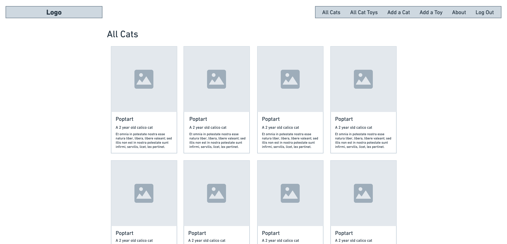
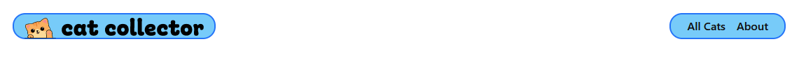
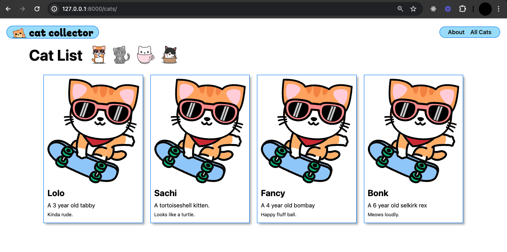

# Cat Collector - Rendering Data in Templates
**Learning objective**: By the end of this lesson, students will be able to render dynamic data within a Django template.

## Render Data in a Template
To see how data is rendered dynamically using Django templating, we're going to implement the following user story: 
> As a User, when I click the **All Cats** link, I want to see a page listing all of my cats so that I can see them all in one place. 

For this User story, we need to build an index page to render a list of all of our cats. To make the UI of this page more appealing, we'll list our cats using "card" style elements in the UI. Each card will have an image placeholder and some brief details about each cat. 

Here is the wireframe for the final design: 


### Step 1 - Identify the Route
For this **index** page user story, what would the RESTful route be? `/cats`

### Step 2 - Create the UI
For navigation, it makes sense to add an "All Cats" link to the nav bar in `base.html`:

```html
<li><a href="/cats">All Cats</a></li>
<li><a href="/about">About</a></li>
```
> Note: Be sure to continue to use leading slashes for routes in your HTML

A quick refresh and we have our link: 



### Step 3 - Define the Route
Add the new route for displaying cats to the `main_app/urls.py` file. This step involves updating the `urlpatterns` list by including a path for the cat index view. 

Let's add the new route to `main_app/urls.py`:

```py
urlpatterns = [
  path('', views.home, name='home'),
  path('about/', views.about, name='about'),
  # route for cats index
  path('cats/', views.cat_index, name='cat-index'),
]
```

In this setup, we use a single `views.py` file for all our view functions. By naming the function `cat_index`, we anticipate potentially adding more index views for other types of resources (like `toys`) in the future. 
> Becuase we are referencing a `cat_index` view that hasn't been defined yet, attempting to navigate to this route will currently result in an error. We'll define the `cat_index` view in the next steps to resolve this. 

### Step 4 - Code the View (Controller Action)
Since we don't yet have a database model for cats, or the infrastructure to add new cats yet, we'll initially use mock data to populate our index page. 

### Let's simulate some cats
In the `main_app/views.py`, we'll create a simple `Cat` class and a list of cat instances to simulate a database of cats. 

```py
# views.py

class Cat:
    def __init__(self, name, breed, description, age):
        self.name = name
        self.breed = breed
        self.description = description
        self.age = age

# Create a list of Cat instances
cats = [
    Cat('Lolo', 'tabby', 'Kinda rude.', 3),
    Cat('Sachi', 'tortoiseshell', 'Looks like a turtle.', 0),
    Cat('Fancy', 'bombay', 'Happy fluff ball.', 4),
    Cat('Bonk', 'selkirk rex', 'Meows loudly.', 6)
]
```
> Note: Everything in a Python module is automatically exported, thus, the Cat class and the cats list will be accessible in other modules. 

Next, let's create the `cat_index` view function that will use this data to render our `index`:

```py
# views.py

def cat_index(request):
    # Render the cats/index.html template with the cats data
    return render(request, 'cats/index.html', {'cats': cats})
```

Two interesting things above: 
1. We organize our templates by creating a dedicated directory for each type of entity. For the cats, we'll store their templates in `templates/cats`. 
2. Just like in Express, where data is passed to templates via an object, in Django, we use a dictionary. This dictionary is passed as the third argument to Django's `render` function, allowing the template to access the cat data. 

This setup not only structures our application neatly but also mimics familiar patterns from other frameworks like Express, making it easier to manage and understand. 

### Step 5 - Respond to the client's HTTP request
Now that we have the code to respond with the `render` method in our view, let's set up the template we'll use for rendering. 

## Creating the Template Directory
First, create a directory to organize templates related to cats:

```bash
mkdir main_app/templates/cats
```

### Creating the template file
Next, create the `cats/index.html` template file: 

```bash
touch main_app/templates/cats/index.html
```

### Populating the template
Now, let's populate this new template with the necessary HTML and DTL tags. Copy and paste the following content into the `cats/index.html` file:

```html
 
 

<link rel="stylesheet" href=""/>
 


<section class="page-header">
  <h1>Cat List</h1>
  
  
  
  
</section>

<section class="card-container">
  
    <div class="card">
      <div class="card-content">
        <div class="card-img-container">
          
        </div>
        <h2 class="card-title">{{ cat.name }}</h2>
        
        <p>A {{ cat.age }} year old {{ cat.breed }}</p>
        
        <p>A {{ cat.breed }} kitten.</p>
        
        <p><small>{{ cat.description }}</small></p>
      </div>
    </div>
  
</section>


```

### Using control flow in templates
Django uses specific template tags to control flow within templates:
- **Looping**: `` and `` tags allow looping over items in a list. 
- **Conditional Statements**: ``, ``, and ``, culminating in ``, manage conditional rendering of template sections.
> These template tags mimic Python's syntax but are specifically designed for template logic, not to execute Python code directly. 

### Template tags and accessing data 
Notice the use of double curly braces `{{ }}` to output variables' values directly in the HTML, which is a feature of Django's template system. When accessing methods on objects, they are called automatically without needing parentheses, simplifying the syntax. 

For more on how DTL works and its syntax, refer to the [official Django documentation on template language](https://docs.djangoproject.com/en/5.1/ref/templates/language/).

Refresh the page and see your index page come alive!

## Adding CSS for `cat_index`
Our html is in place but our images are controlling our page. Let’s add soe custome css to control the elements on our page a bit.

In the terminal create the files:

```bash
mkdir main_app/static/css/cats
touch main_app/static/css/cats/cat-index.css
```

And add some CSS in that file: 

```css
.card-container {
  padding: 0 30px;
  display: flex;
  justify-content: center;
  flex-wrap: wrap;
}

.card {
  width: 275px;
  margin: 10px;
  border: var(--borders);
  box-shadow: var(--card-box-shadow);
}

.card-content {
  padding: 10px;
  width: 100%;
}

.usr-img {
  width: 100%;
  border-radius: var(--card-border-radius);
}

.card > a {
  text-decoration: none;
  color: var(--text-color);
}

.card h2 {
  margin: 10px 0;
  font-size: var(--font-xl);
}

.card p {
  margin: 5px 0;
  font-size: var(--font-reg);
}
```

Refresh to see your new index page!



## You Do: Create a template for the home page
In this exercise, you'll create a new template for the home page of our application, similar to the index page we just finished. 

### Step 1: Create the home page template file
- Start by creating the template file `home.html` for the home page in the `main_app/templates/` directory.

### Step 2: Update the home view
- Modify the home view in your `main_app/views.py` to render the new `home.html` template. 
- Since you are no longer using `HttpResponse` directly in this view, you can remove its import statement from the top of the file if it's no longer used elsewhere.

### Step 3: Extend the base template and add content
- Open your newly created `home.html` and set it up to extend from the base template.
- Add some content and link the necessary CSS files with the following: 

```html



<link rel="stylesheet" href="" />



<section class="logo-container">
  <div class="cat-container">
    
  </div>
  
</section>


```

### Step 4: Create a CSS file for the new home page
- Create a new CSS file `home.css` in `static/css/` to style your home page. 
- Add the following CSS code:

```css
main {
  display: flex;
  align-items: center;
  justify-content: center;
  flex-wrap: wrap;
  height: 100%;
}

main > section {
  width: 100%;
  padding: 10px 8px;
  display: flex;
  align-items: center;
  justify-content: center;
  flex-direction: column;
}

.header-logo-container {
  display: none;
}

.logo-container {
  max-width: 375px;
}

.cat-container {
  width: 80%;
}

.login {
  display: flex;
  flex-direction: column;
  justify-content: center;
  align-items: center;
  width: 80%;
}

.login h1 {
  font-size: clamp(3.2rem, 3vw, 4.8rem);
  margin: 10px 0;
}

.login > p {
  display: flex;
  flex-direction: column;
  width: 100%;
  margin: 14px 0 0px;
}

.login label {
  font-size: var(--font-reg);
  margin-bottom: 6px;
}

.login input {
  font-size: var(--font-l);
  padding: 2px 4px;
}

.login .btn {
  align-self: flex-end;
  margin-right: 0;
  margin-top: 16px;
}

@media only screen and (min-width: 768px) {
  main {
    justify-content: space-around;
  }

  main > section {
    width: 40%;
  }

  .login {
    border: var(--borders);
    padding: 20px;
    border-radius: var(--card-border-radius);
    box-shadow: var(--card-box-shadow);
    width: 100%;
  }

  .logo-container {
    max-width: 520px;
  }
}
```

Refresh the browser to see your new home page in action!

### Progress Recap
You’ve successfully created a basic yet functional Django application that displays an index page with a dynamically rendered list of Cat objects. Congrats!

At this point, you’re probably familiar with the essentials of Django’s URL configuration and the general structure of a Django app. While we’ve covered the fundamentals of views and Django Template Language, there’s more to explore.

We’re going to get our first look at Models in the next lesson where we’ll use one to replace the current Cat class so that we can save cats in the database!